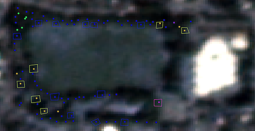

# Data {#data}

There are two sources of data in this project. Data at a pixel level come from satellite images downloaded from Planet.com (https://www.planet.com), and data at the ground level come from library `pdxTrees` in RStudio (https://github.com/mcconvil/pdxTrees). 

### Imaging

Satellite images come from Planet.com's PS2.SD instrument found on Dove-R satellites that were launched in 2017. Satellites have an approximate frame size of 20km x 12 km. To separate the light into red, blue, green, and near-infrared (NIR) channels, the telescope has a high-performance butcher-block filter made of 4 individual pass-band filters. Planet.com equates this pass-band filter with that of Sentinel-2.

As it orbits the Earth, the satellite captures continuous strips of single frame images that are split into a RGB frame and NIR frame. The butcher-block pass separately photographs the red, blue, green, and NIR bands and then combines all four to form an image. Images are are downloaded already fully processed and ready to be analyzed. The process includes corrections for radiometric calibration, terrain distortions corrections, elevation corrections, and atmospheric corrections.

The images used in this research were taken on September 2nd, 2020 at an altitude of 475 km. Images are taken from the summer months to reduce the chance of rain clouds and capture peak greenness of the trees. The compiled multi-spectral image is composed of 4 bands: blue, green, red, and NIR, with center wavelengths 490 nm, 565 nm, 665 nm, and 865 nm respectively, with an average bandwidth of 41 nm. The average spatial extent is around 25 km by 8 km. The images cover the entire Portland area, with specific measurements of 26 km from west to east and 30 km from north to south. The spatial resolution of the pixels is approximately 3 meters.

Planet.com provides a way to download free images that are already processed and corrected for analysis. Some drawbacks to using this data are the limited number of downloads available per free account, the low spatial resolution, which decreases the performance of statistical models trying to predict tree species location, and the low spectral resolution, so the satellite sensor cannot detect wavelengths in detail.

### Ground Data
Ground level data is available from the ‘pdxTrees’ package in RStudio. This data was collected as part of the Portland’s Parks and Recreation’s Urban Forestry Tree Inventory Project, which collected park tree information from 2017 to 2019. Originally, the inventory project started with the goal of improving the city's tree management plans. Under the guidance of US Forestry staff, volunteers around the city's neighborhoods are trained in identifying tree species and provided with tools necessary to record tree measurements. Measurements in feet were made using diameter tape. The Portland park trees inventory consists of over 25,000 trees, each with information about tree location, size, species, and health. For the purposes of this project, the following variables were selected:

* Spatial information: Longitude and latitude of tree. Location of tree is recorded on a tablet with Collector for ArcGIS and recorders manually select the tree from a satellite image on the screen. The tree's location is mapped over the satellite images in QGIS for analysis.

* Species: Tree genus, species, and common name. The tree species is used to train the model and predict the tree species of pixels in the test data.


* Crown size: Crown width from north to south, crown width from east to west, and the base height of the crown in feet. The crown of the tree is the tree's above ground leaves, so the crown width is the longest horizontal distance that can be measured between the leaves of the tree. A measuring wheel is used to measure this distance.

* Tree Condition: Categorical variable with four categories (from best to worst), good, fair, poor, and dead. A tree was considered good if the tree is strong and has no apparent issues, fair if the tree is average condition with possibly a few dead branches, poor if the tree has major wounds and dead major canopy loss, and dead if the tree has no live leaves.

To prepare the ground level data for training the model, the data was filtered by species and crown size. The following tree species were identified and included: maples, oak, Douglas-fir, Western Redcedar, and sequoia. These species are all native to the Pacific Northwest, so they benefit the ecosystem and having a model of these trees will help track the species' locations. Since the data is used to identify trees in the satellite images, the ground data was also filtered to only include the trees with a crown width from north to south of 20 feet or more, this ensures that there will be around 9 to 20 pixels per tree.

Portland's Tree Inventory includes a variable for identifying trees including Western Redcedars as well as variables for filtering to include larger trees canopies (at least 6m in diameter) in the dataset, which helps construct a training set of tree polygons over a satellite image. This data would be even better suited for the purposes of this project if the street trees subdata also contained variables for tree canopy size.

### Training Data

#### Characteristics of Training Data

The training data at the ground-level was filtered by tree size and tree type. Trees with at least 20 feet in north to south crown width were included in the training dataset to ensure that the polygons around each tree contain around 9 to 20 pixels. Figure \@ref(fig:crownWidth) plots the north to south crown width values against the west to east crown width values to present the ranges of crown widths in the entire pdxTrees parks dataset and to justify only using the north to south crown width for filtering the dataset since the two variables have a strong positive correlation.

```{r crownWidth, warning=F, message=F, echo=F, fig.cap='Plot comparing North to South Crown Width (ft) to West to East Crown Width (ft). A tree with a higher north-south crown width has a higher west-east crown width, so without loss of generality the north-south crown width variable is used to filter the dataset for larger trees only.'}
pdxTrees_parks <- get_pdxTrees_parks()
ggplot(pdxTrees_parks, aes(x = Crown_Width_NS, y = Crown_Width_EW)) +
  geom_point(alpha = 0.4) +
  theme_classic() + labs(x = "North to South Crown Width (ft)", y = "West to East Crown Width (ft)")
```


Six tree types were determined to have large enough canopies on average and appear frequently enough to construct a training dataset with plenty of observations for each species of tree: Douglas-Fir, English Oak, Giant Sequoia, Maple, Western Redcedar. Table \@ref(tab:pointsTable) provides the number of trees under each common name category. The largest group contains 6485 observations of Douglas-Fir trees, and the smallest group contains 135 observations of English Oak trees.


```{r pointsTable, warning=F, message=F, echo=F, fig.cap='Common tree names included in the tidy data and their total counts.'}
train_points <- pdxTrees_parks %>%
  dplyr::filter(Species %in% c("QURO", "SEGI", "ACPL", "PSME", "ACMA", "THPL"), Crown_Width_NS >= 20)

train_points_dat <- train_points %>%
  group_by(Common_Name) %>%
  summarise(counts = n()) %>%
  arrange(desc(counts))

knitr::kable(train_points_dat, col.names = c("Tree Name", "Tree Count"), "latex", caption = "Common tree names included in the tidy data and their total counts.")
```

#### Creating Spatial Polygons

The training dataset was converted into shapefiles for each type of tree and exported into QGIS where polygons were manually drawn around 100 of the trees for each species. The point shapefile layers were displayed over the raster images downloaded from Planet.com in QGIS, which provided a guide point for locating individual trees. Then using QGIS's drawing tool, a polygon is carefully drawn around the tree canopy (see Figure \@ref(fig:polyimage) and Figure \@ref(fig:redcedar)). Most polygons turned out to be four to six-sided polygons to retain the general shape of the tree canopy. Trees polygons were only created if the outline of the tree canopy was clearly visible or surrounded by other trees of the same species in order to avoid including pixels from the wrong species in that polygon. Also, the shadows of the trees are visible in the raster images, so the polygons were drawn with the intention of not including the tree shadow. For the five different species of trees, at least 100 polygons were drawn around trees of that type, with each polygon containing at least 6 pixels and at most 20 pixels. The polygon shapefiles were then exported into RStudio where the rest of the analysis was conducted.

```{r polyimage, results="asis", echo=FALSE, fig.cap="Polygons drawn around different tree species: maples (blue), sequoias (yellow), redcedars (pink). Note there are no polygons around trees with canopies that overlap with canopies of different tree species, like douglas-firs (green), to avoid misclassifying pixels from different tree species.", out.width='50%', fig.align='center'}

```

```{r redcedar, results="asis", echo=FALSE, fig.cap="Polygons drawn around redcedar trees", out.width='50%', fig.align='center'}

```


#### Polygon Limitations

Ideally, the raster strips contain training trees of each species, and as a result, the polygons are evenly distributed across the raster strips, but due to limitations of our ground-level data this is not achievable. At a glace, each of the raster strips contain manually drawn polygons, so moving forward, it is assumed that there is equal variation across individual strips.

The polygons are drawn with the intention of outlining pixels for a known tree species so that the extracted pixels truly represent that species and so that there is a sufficient amount of pixels per species, however, limitations of the satellite images' resolution make some error inevitable. Many parks trees have canopies that overlap, which cause some polygons to contain pixels from trees of different species. Other pixel errors might come from including pixels that are cast in shadow by the polygon's training tree or by surrounding infrastructure. To avoid these errors, polygons with uncertain canopies are cross-checked with the satellite filter on Google Maps. For example, a point in QGIS that is indicated as a douglas-fir tree might appear as one tree on the low-resolution image from Planet.com, but a closer look at Google Maps shows that it is actually two trees in close proximity. Having low spatial resolution decreases the number of pixels available within a polygon, but that has to be balanced out with the need for a large number of pixels. With regards to the number of pixels per tree species, having around the same number of tree polygons per species results in differing amounts of pixels per species due to the different average sizes of tree canopies for different species. After drawing the images, the pixels totals per tree species is computed to ensure that the training pixels data contains at least 800 pixels per tree species.

#### Combining Ground-level Data with Pixel-level Data

The first spatial join in RStudio was conducted to match up each Spatial Polygon with a point in the training dataset. Then the raster images were loaded and joined with the polygons to extract the pixel values inside each polygon for all 4 bands (red, green, blue, infrared). Ultimately this turned into a pixel table with rows representing each pixel with its corresponding polygon, light reflection intensity values for all 4 bands, and the ground information about that tree. Table \@ref(tab:pixelHead) displays the first few entries of the pixels dataset. Table \@ref(tab:pixelCounts) contains the summary of the total number of pixels for each tree type.

```{r pixelHead, echo=F, warning=F, message=F, fig.cap='Variables and pixel values included in the pixels dataset', fig.width=4}
# load data
pixels_data <- read.csv('~/tree_imaging/pixels_data.csv')
pixels_head <- head(pixels_data)

knitr::kable(pixels_head, caption = "Variables and pixel values included in the pixels dataset") %>%
  kable_styling(latex_options = c("scale_down"))
```


```{r pixelCounts, echo=F, warning=F, message=F, fig.cap='Number of pixels per tree type'}
pixels_summary_dat <- pixels_data %>%
  group_by(Cmmn_Nm) %>%
  summarise(counts = n())

knitr::kable(pixels_summary_dat, col.names = c("Tree Name", "Pixels Count"), "latex", caption = "Number of pixels per tree type")
```

Figure \@ref(fig:pixDensity) displays the range of reflection intensity pixel values per tree type. Each tree species has similar ranges of values over the red, green, blue, and infared bands. Of the species included in the training data, the Giant Sequoia trees appear to have higher density counts for the red, green, and blue bands.

```{r pixDensity, echo=F, warning=F, message=F, fig.cap=' '}
ggplot(pixels_data) +
  geom_density(aes(x = red), col = "red") +
  geom_density(aes(x = blue), col = "blue") + 
  geom_density(aes(x = green), col = "green") + 
  geom_density(aes(x = ir), col = "purple") + 
  facet_wrap(~Cmmn_Nm)+
  theme_classic() + labs(x = "Reflection Intensity", y = "Density")
```


<!-- <!-- Required to number equations in HTML files --> -->
<!-- <script type="text/x-mathjax-config"> -->
<!-- MathJax.Hub.Config({ -->
<!--   TeX: { equationNumbers: { autoNumber: "AMS" } } -->
<!-- }); -->
<!-- </script> -->

<!-- ## Math -->

<!-- \TeX\ is the best way to typeset mathematics. Donald Knuth designed \TeX\ when he got frustrated at how long it was taking the typesetters to finish his book, which contained a lot of mathematics.  One nice feature of _R Markdown_ is its ability to read LaTeX code directly. -->

<!-- If you are doing a thesis that will involve lots of math, you will want to read the following section which has been commented out. If you're not going to use math, skip over or delete this next commented section. -->


<!-- MATH and PHYSICS majors: Uncomment the following section -->
<!--
$$\sum_{j=1}^n (\delta\theta_j)^2 \leq {{\beta_i^2}\over{\delta_i^2 + \rho_i^2}}
\left[ 2\rho_i^2 + {\delta_i^2\beta_i^2\over{\delta_i^2 + \rho_i^2}} \right] \equiv \omega_i^2
$$

From Informational Dynamics, we have the following (Dave Braden):

After _n_ such encounters the posterior density for $\theta$ is

$$
\pi(\theta|X_1< y_1,\dots,X_n<y_n) \varpropto \pi(\theta) \prod_{i=1}^n\int_{-\infty}^{y_i}
   \exp\left(-{(x-\theta)^2\over{2\sigma^2}}\right)\ dx
$$

Another equation:

$$\det\left|\,\begin{matrix}%
c_0&c_1\hfill&c_2\hfill&\ldots&c_n\hfill\cr
c_1&c_2\hfill&c_3\hfill&\ldots&c_{n+1}\hfill\cr
c_2&c_3\hfill&c_4\hfill&\ldots&c_{n+2}\hfill\cr
\,\vdots\hfill&\,\vdots\hfill&
  \,\vdots\hfill&&\,\vdots\hfill\cr
c_n&c_{n+1}\hfill&c_{n+2}\hfill&\ldots&c_{2n}\hfill\cr
\end{matrix}\right|>0$$


Lapidus and Pindar, Numerical Solution of Partial Differential Equations in Science and
Engineering.  Page 54

$$
\int_t\left\{\sum_{j=1}^3 T_j \left({d\phi_j\over dt}+k\phi_j\right)-kT_e\right\}w_i(t)\ dt=0,
   \qquad\quad i=1,2,3.
$$

L\&P  Galerkin method weighting functions.  Page 55

$$
\sum_{j=1}^3 T_j\int_0^1\left\{{d\phi_j\over dt} + k\phi_j\right\} \phi_i\ dt
   = \int_{0}^1k\,T_e\phi_idt, \qquad i=1,2,3 $$

Another L\&P (p145)

$$
\int_{-1}^1\!\int_{-1}^1\!\int_{-1}^1 f\big(\xi,\eta,\zeta\big)
   = \sum_{k=1}^n\sum_{j=1}^n\sum_{i=1}^n w_i w_j w_k f\big( \xi,\eta,\zeta\big).
$$

Another L\&P (p126)

$$
\int_{A_e} (\,\cdot\,) dx dy = \int_{-1}^1\!\int_{-1}^1 (\,\cdot\,) \det[J] d\xi d\eta.
$$
-->

<!-- ## Chemistry 101: Symbols -->

<!-- Chemical formulas will look best if they are not italicized. Get around math mode's automatic italicizing in LaTeX by using the argument `$\mathrm{formula here}$`, with your formula inside the curly brackets.  (Notice the use of the backticks here which enclose text that acts as code.) -->

<!-- So, $\mathrm{Fe_2^{2+}Cr_2O_4}$ is written `$\mathrm{Fe_2^{2+}Cr_2O_4}$`. -->

<!--
The \noindent command below does what you'd expect:  it forces the current line/paragraph to not indent. This was done here to match the format of the LaTeX thesis PDF.
-->

<!-- \noindent Exponent or Superscript: $\mathrm{O^-}$ -->

<!-- \noindent Subscript: $\mathrm{CH_4}$ -->

<!-- To stack numbers or letters as in $\mathrm{Fe_2^{2+}}$, the subscript is defined first, and then the superscript is defined. -->

<!-- \noindent Bullet: CuCl $\bullet$ $\mathrm{7H_{2}O}$ -->


<!-- \noindent Delta: $\Delta$ -->

<!-- \noindent Reaction Arrows: $\longrightarrow$ or  $\xrightarrow{solution}$ -->

<!-- \noindent Resonance Arrows: $\leftrightarrow$ -->

<!-- \noindent Reversible Reaction Arrows: $\rightleftharpoons$ -->

<!-- ### Typesetting reactions -->

<!-- You may wish to put your reaction in an equation environment, which means that LaTeX will place the reaction where it fits and will number the equations for you.  -->

<!-- \begin{equation} -->
<!--   \mathrm{C_6H_{12}O_6  + 6O_2} \longrightarrow \mathrm{6CO_2 + 6H_2O} -->
<!--   (\#eq:reaction) -->
<!-- \end{equation} -->

<!-- We can reference this combustion of glucose reaction via Equation \@ref(eq:reaction). -->

<!-- ### Other examples of reactions -->

<!-- $\mathrm{NH_4Cl_{(s)}}$ $\rightleftharpoons$ $\mathrm{NH_{3(g)}+HCl_{(g)}}$ -->

<!-- \noindent $\mathrm{MeCH_2Br + Mg}$ $\xrightarrow[below]{above}$ $\mathrm{MeCH_2\bullet Mg \bullet Br}$ -->

<!-- ## Physics -->

<!-- Many of the symbols you will need can be found on the math page <https://web.reed.edu/cis/help/latex/math.html> and the Comprehensive LaTeX Symbol Guide (<https://mirror.utexas.edu/ctan/info/symbols/comprehensive/symbols-letter.pdf>). -->

<!-- ## Biology -->

<!-- You will probably find the resources at <https://www.lecb.ncifcrf.gov/~toms/latex.html> helpful, particularly the links to bsts for various journals. You may also be interested in TeXShade for nucleotide typesetting (<https://homepages.uni-tuebingen.de/beitz/txe.html>).  Be sure to read the proceeding chapter on graphics and tables. -->

