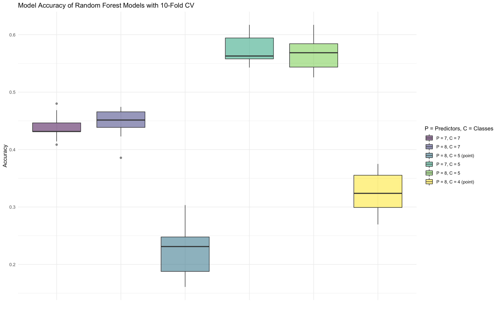

# Methods {#methods}

## Current Methods

Since the Western redcedar decline is recent, there are currently no published work for identifying tree species like Western redcedars for the Pacific Northwest using satellite imaging. However, a similar study identifies tree species for a strip of land in California by combining ground-level data with satellite images [@fricker_convolutional_2019]. Their methods involved drawing polygons around rastered images that are layered with ground data as explained in Chapter \@ref(data), but the pixels from the polygons are used to train a convolutional neural network (CNN) model instead of the random forests and support vector machines in this study. The CNN model was then evaluated with k-fold cross validation. CNN models are appropriate in a classification setting and when working with satellite images because they account for spatial relations, which is likely to appear in classifying tree species. This study follows the methods of preparing the data for modelling as well as the cross validation method to evaluate the performance of the random forests and support vector machines models. Random forests use random feature selections to create decision trees and increase the number of correctly classified observations. Random forests have the advantage of being simplier to train and still performs at a similar level as CNN models.

### Random Forest

In building a decision tree for classification, recursive binary splits are made by minimizing the Gini index ($G$), the total variance across $K$ classes:

$$G = \sum_{k = 1}^K\hat{p}_{mk}(1 - \hat{p}_{mk}),$$

where $\hat{p}_{mk}$ is the proportion of observations in the $m^{\text{th}}$ region from the $k^{\text{th}}$ class. A small Gini index value represents a region containing mostly observations from a single class, while a large Gini index value represents a lot of variation within classes. Then the decision tree is constructed by repeatedly considering different attributes and making splits where the Gini index is minimized. Note that this top-down, greedy approach tends to overfit the training data, so finding the decision tree that performs the best on test data involves a cost-complexity pruning algorithm to obtain smaller trees and apply k-fold cross validation to choose the best tree that minimizes the average error.

In the classification setting, a stronger predictive model than a decision tree is a random forest, which uses an element of randomness to decorrelate bootstrapped decision trees. Bootstrapped samples from the training dataset are used to construct decision trees, where splits are based on minimizing the Gini index when selecting from a random sample $m$ of attributes from all $p$ available. In common random forest applications, the number of attributes considered at a split is $m \approx \sqrt{p}$. Theoretically, by forcing only a subset of attributes to be featured in the tree, this expands the number of possible subtrees that might not have been achieved by the top-down, greedy approach. Hence, random forests provide a method of predicting classes with low variance while also keeping bias at a minimum.

### Support Vector Machine

Another method investigated in this study imagines the multidimensional data in space and classifies the data using hyperplanes positioned to minimize misclassification error and maximize distance from observations to separate the data. Support vectors are vectors in space that represent the subset of observations which influence the hyperplane classifier. For example, in two dimensions, imagine a line separating A's one one side and B's on the other side. This line is the maximal margin hyperplane if it is the farthest possible from the observations and also separates the two classes perfectly. Observations that are closer to the hyperplane (support vectors) have more influence over the line if they move than observations that are further. Consequently, more support vectors indicates a classifier with lower variance and high bias. A tuning parameter can be altered to expand or shrink the margin of error surrounding the hyperplane (how far away the observations have to be from the plane) and decide the level of tolerance for misclassifying observations.

Support vector machines can be applied in a linear or nonlinear setting with the use of kernels. A kernel is a function $K(x_i, x_{i'})$ of two observations specifying the similarities between two points. Given data with $n$ observations, let $x_i$ be an observation, where $i = 1, ... ,n$. A linear kernel is 

$$K(x_i, x_{i'}) = \sum_{j = 1}^p x_{ij}x_{i'j}$$
with a support vector classifier

$$f(x) = \beta_0 + \sum_{i = 1}^n \alpha_i \langle x, x_i \rangle.$$

The parameters $\alpha_i$ and $\beta_0$ are estimated using the inner products of the observations, but $\alpha_i \neq 0$ if and only if $x_i$ is a support vector. Note that this function is similar to a linear regression function. Extended this model to a nonlinear context involves a similar approach as adding nonlinear terms to a regression model.

The polynomial kernel of degree $d$ is defined to be 

$$K(x_i, x_{i'}) = \left( 1 + \sum_{j = 1}^p x_{ij}x_{i'j}\right)^d$$

with support vector classifier

$$f(x) = \beta_0 + \sum_{i = 1}^n \alpha_i K(x, x_i).$$
For some positive constant $k$, the radial kernel is defined to be

$$K(x_i, x_{i'}) = \mbox{exp}\left( -\gamma\sum_{j = 1}^p(x_{ij} - x_{i'j})^2 \right),$$

which makes the support vector machine more sensitive to nearby observations as opposed to further observations. 

Support vector machines are less sensitive to outliers and successful predictors of categorical variables in high-dimensional data. A support vector machine does not perform well for data with observations that overlap and if the kernel is incorrectly selected.


## Training Models

To model the tree type of the pixels in raster image, a random forest model and a support vector machine model are trained using the pixels training data. First the data is separated into a training set and then a test set by a ratio of 70% training data and 30% testing data. The `dplyr` function `slice_sample` was used to take a stratified sample from the entire pixels dataset where 70% of each tree species in an individual raster strip was randomly selected. For example, 70% of the bigleaf maple trees in raster strip 'A' were randomly selected for the training set. To train these models, k-fold cross validation is used. The data gets split into $k = 10$ folds and ten models are trained each time withholding one of the ten folds until the process goes through every fold. This process aids in understanding how the models will perform against data that has not been included in training the model.

The selected variables for training the models are the four bands (red, green, blue, infrared) and an NDVI variable, and the predictive variable is the tree species name. Some predictor variables were manually computed using ratios of bands. Typically, a long over short band ratio provides some more information to train the model. The following bands were created: red/blue, ir/red, red/green, and blue/green. Examining a correlation matrix with these predictors reveals some possibly useful and not too highly correlated variables are red/green, red/blue, and blue/green (see Figure \@ref(fig:corrmatrix).

```{r corrmatrix, results="asis", echo=FALSE, fig.cap="Correlation matrix of possible predictor variables to include in the model", out.width='70%', fig.align='center'}
include_graphics("figure/corrmatrix.png")
```


The `caret` package [@caret] in RStudio stands for classification and regression training, and it contains functions for facilitating the process of creating training models in R and determining the tuning parameters. 

The `train` function from the `caret` package [@caret] with the specified `method = rf` option is used to train a random forest model on the training dataset to predict the tree species. The function takes parameters for data, the predictive variable, and the method of training the model. To perform k-fold cross validation, the `trainControl` function is used to create an object that tells the `train` function to perform cross validation 10 times with a different fold left out each time. The number of tries at each split is by default the floor of the square root of the number of predictors available. Three different models were considered with varying number of predictors:

* 5 predictor model: red, green, blue, ir, ndvi

* 7 predictor model: red, green, blue, ir, ndvi, red_green, blue_green

* 8 predictor model: red, green, blue, ir, ndvi, red_green, red_blue, blue_green.

Figure \@ref(fig:rfresults) compares the results of the models based on overall model accuracy in predicting the test data.

```{r rfresults, results="asis", echo=FALSE, fig.cap="Comparison of results from random forest models with different predictors included", out.width='70%', fig.align='center'}

```

The model with the highest number of predictors included has a slightly higher median accuracy and mean accuracy than the 7 predictor model. A confusion matrix was constructed for each model averaging the entry counts over all ten cross validation resamples to investigate model performance just predicting Western redcedar tree pixels. Both the 7 and the 8 predictor models performed equally classifying Western redceder pixels, the 7 predictor model and the 8 predictor model had a prediction accuracy of 38%, while the 5 predictor model had 35%. Across all three models, Western redcedars tend to be inaccurately classified under douglas-firs, english oak, and norway maple trees.

The training set with 8 predictors was selected for further tuning of the random forest model, to determine the ideal number of randomly selected predictors at each split. Figure \@ref(fig:rfmtry) displays a comparison of the accuracy of the number of tries considered at each split. The most accurate model uses 2 randomly selected predictors at each split, with a model accuracy of 0.545.

```{r rfmtry, results="asis", echo=FALSE, fig.cap="Comparison of number of randomly selected predictors for each split from random forest model with 8 predictors included", out.width='70%', fig.align='center'}

```


The `train` function has the `method = svmLinear/svmRadial/svmPoly` option to train a support vector machine model on the dataset to classify pixels into species of trees. This option also has parameters for cost, loss function, class weights, and normalized variables. For this project, three support vector machines were trained: linear, radial basis, and polynomial basis, and all three were specified to normalize the variables.

Figure \@ref(fig:svmresults) displays the results of the linear, radial basis, and polynomial basis support vector machine models. Based on the overall prediction accuracy, the radial basis is an appropriate kernel choice for the pixels data since it has a higher median model accuracy than the other two kernel options.

```{r svmresults, results="asis", echo=FALSE, fig.cap="Comparison of results from support vector machine models with different kernel types: linear, radial, and polynomial.", out.width='70%', fig.align='center'}

```

As with the random forest model comparisons, a confusion matrix was constructed using the average counts over all ten cross-validation resamples to obtain the model results predicting Western redcedars. The support vector machine model that performed best overall was the radial basis kernel model, and it had the highest prediction accuracy of the Western redcedar class, 41%. The polynomial basis kernel had a 34% prediction accuracy and the linear kernel had 32% accuracy for Western redcedar.

Table \@ref(tab:resultsR) compares the hyperparameters accross all models.

```{r resultsR, echo=F, warning=F, message=F, fig.cap='Chart', out.width='100%'}
results_r <- read.csv('~/tree_imaging/results_r.csv', check.names = F)
results_s <- read.csv('~/tree_imaging/results_s.csv', check.names = F)

# knitr::kable(results_r, "latex", caption = "Accuracy of random forest models with different number of predictors and model with best ntry parameter determined by ten-fold cross validation.")
knitr::kable(list(results_r, results_s), "latex", caption = "Table of Hyperparameters", booktabs = T)
# t1 <- kable(results_r, format = 'latex')
# t2 <- kable(results_s, format = 'latex')
# cat(c("\\begin{table}[h] \\centering ", 
#       t1,
#     "\\hspace{1cm} \\centering ",
#       t2,
#     "\\caption{My tables} \\end{table}"))  
```


The models are saved to be used for later prediction over the entire region of Portland.

## Preparing Raster Images
The training model has to be applied to the entire raster image to predict the location of Western redcedars, however, extracting all the pixels from raster images is a slow process. Filtering the rasters to keep vegetation and to recognize the difference between grass pixels and tree pixels alleviates the computational intensity of extracting all the pixels and improves the performance of the models.

### Masking Vegetation
The satellite images in RStudio need to be masked to reduce the number of pixels that the model has to classify and prevent the chance of a non-vegetation surface being predicted as a tree. A common mask applied to raster images is a Normalized Difference Vegetation Index (NDVI) mask. This index is a measure of the greenness of a pixel, with higher values indicating vegetation and lower values indicating infertile areas such as a rock. The formula for NDVI is $NDVI = \frac{NIR - Red}{NIR + Red}$. Figure \@ref(fig:ndvival) displays the density of NDVI values over the raster images. To remove the pixels that are not vegetation, an NDVI threshold is determined to be 0.00 to create a mask dividing the pixels into vegetation (1) and non-vegetation (0). When the trained model is applied to the raster image, it is applied to the masked raster image that only keeps pixels with NDVI mask values of 1.

```{r ndvival, results="asis", echo=FALSE, warning=F, message=F, fig.cap="Normalized Difference Vegetation Index (NDVI) is a measure of the greenness of a pixel. The histogram displays the frequency of the tree pixels' NDVI values. A good threshold for masking out the nonvegetation pixels is an NDVI of 0.", fig.width=4, fig.align='center'}
ggplot(pixels_data, mapping = aes(x = ndvi)) +
  geom_histogram(alpha = 0.6, fill = "blue") +
  geom_vline(xintercept = 0.0) +
  theme_minimal() + labs(x = "NDVI values", y = "frequency")
```

### Masking Grass
<!-- Further preparation for applying the model to the entire mask involved creating grass polygons in QGIS to add a grass attribute in the model. Five fields of grass were outlined as polygons in QGIS. In RStudio, the pixels were extracted from the grass polygons for a total of 2,923 grass pixels. Training the model to also predict grass ensures that a field of grass will not be classified as a tree when applied to the entire raster image. -->

A second mask is applied to the NDVI masked raster image to distinguish tree pixels from grass pixels. Inspired by previous research, a grass index was created by averaging the values of the four bands, $GRASS = \frac{RED + BLUE + GREEN + NIR}{4}$  [@qian_new_2020]. Grass polygons were created in QGIS to add a grass attribute in the pixels dataset. Five fields of grass were outlined as polygons in QGIS. In RStudio, the pixels were extracted from the grass polygons for a total of 2,923 grass pixels. Figure \@ref(fig:grassval) displays how the average band values for the grass pixels differ from the other tree types average band values. Based on the figure, pixels in the raster image that have an average band value above 4900 are filtered out.  Masking the grass pixels ensures that a field of grass will not be classified as a tree when applied to the entire raster image

```{r grassval, results="asis", echo=FALSE, warning=F, message=F, fig.cap="Average of band values distribution across different tree types in comparison with grass pixel average band values. Most grass pixels have an average value above 4900, so a mask is applied to the raster image to remove pixels with average values above this threshold.", fig.width=7, fig.align='center'}
ggplot(pixels_data, mapping = aes(x = (ir + red + blue + green)/4, fill = Cmmn_Nm)) +
  geom_density(alpha = 0.7) +
  geom_vline(xintercept = 4900, color = "blue") +
  scale_fill_brewer(palette = "Set2", name = "Tree Name") + theme_minimal()
```

Figure \@ref(fig:beforeaftermask) displays a raster strip with every pixel included (top), only the pixels with NDVI values above 0.00 (middle), and only pixels with NDVI values above 0.00 and average band values below 4900 (bottom). Ideally, the bottom image is left with only the tree pixels in the image.

```{r beforeaftermask, results="asis", echo=FALSE, fig.cap="A raster strip with every pixel included (top), only the pixels with NDVI values above 0.00 (middle), and only pixels with NDVI values above 0.00 and average band values below 4900 (bottom)", out.width='40%', fig.align='center'}

```

### Masking Limitations

The low resolution of the raster images cause shapes to appear blurry, and especially tree canopies that are close together appear as a single formation.

Masked raster images were compared in QGIS and, in general, the masks are successful in keeping the forest pixels while still removing building structures and roads. If a field of grass is a brownish color, it gets removed, but some greener fields are not masked out. The masks consistently remove river pixels but not lake pixels if the lake is a greenish color. For example, Smith Lake in North Portland is considered an urban wetland, which signifies a body of water with a lot of vegetation. From the perspective of a satellite, this looks like a field of grass. However, the average band pixel values are less than 4900, so they are not masked out by the final GRASS mask stage, and instead are treated as tree pixels in the model (see Figure \@ref(fig:masklimit)).

To address leftover grass pixels in the filtered raster image, access to lidar data would provide a method of determining the height of certain pixels. Setting a height threshold would ensure that grass pixels are removed while higher vegetation pixels are kept. This would also address the masks' limitations in removing lakes with high vegetation, since those pixels would not meet the threshold for height.

```{r masklimit, results="asis", echo=FALSE, fig.cap="Satellite view of Smith Lake (top), after NDVI mask applied (middle), and NDVI mask and GRASS mask applied (bottom). The final masked image still contains parts of the lake because the aquatic vegetation fits the pixel values descriptions set by the masks.", out.width='40%', fig.align='center'}

```


## Modelling Tree Species in Portland

After masking the raster images of the entire region of Portland, the pre-trained models are used to predict the tree species of individual pixels in the masked raster images. First the pixels are extracted from the raster and compiled into a dataset. Then the models are applied to predict the tree species per pixel in the dataset.

```{r include_packages_2, include = FALSE}
# This chunk ensures that the thesisdown package is
# installed and loaded. This thesisdown package includes
# the template files for the thesis and also two functions
# used for labeling and referencing
if (!require(remotes)) {
  if (params$`Install needed packages for {thesisdown}`) {
    install.packages("remotes", repos = "https://cran.rstudio.com")
  } else {
    stop(
      paste(
        'You need to run install.packages("remotes")',
        "first in the Console."
      )
    )
  }
}
if (!require(dplyr)) {
  if (params$`Install needed packages for {thesisdown}`) {
    install.packages("dplyr", repos = "https://cran.rstudio.com")
  } else {
    stop(
      paste(
        'You need to run install.packages("dplyr")',
        "first in the Console."
      )
    )
  }
}
if (!require(ggplot2)) {
  if (params$`Install needed packages for {thesisdown}`) {
    install.packages("ggplot2", repos = "https://cran.rstudio.com")
  } else {
    stop(
      paste(
        'You need to run install.packages("ggplot2")',
        "first in the Console."
      )
    )
  }
}
if (!require(bookdown)) {
  if (params$`Install needed packages for {thesisdown}`) {
    install.packages("bookdown", repos = "https://cran.rstudio.com")
  } else {
    stop(
      paste(
        'You need to run install.packages("bookdown")',
        "first in the Console."
      )
    )
  }
}
if (!require(thesisdown)) {
  if (params$`Install needed packages for {thesisdown}`) {
    remotes::install_github("ismayc/thesisdown")
  } else {
    stop(
      paste(
        "You need to run",
        'remotes::install_github("ismayc/thesisdown")',
        "first in the Console."
      )
    )
  }
}
library(thesisdown)
library(dplyr)
library(ggplot2)
library(knitr)
flights <- read.csv("data/flights.csv", stringsAsFactors = FALSE)
```


<!-- # Tables, Graphics, References, and Labels {#ref-labels} -->

<!-- ## Tables -->

<!-- In addition to the tables that can be automatically generated from a data frame in **R** that you saw in [R Markdown Basics] using the `kable()` function, you can also create tables using _pandoc_. (More information is available at <https://pandoc.org/README.html#tables>.)  This might be useful if you don't have values specifically stored in **R**, but you'd like to display them in table form.  Below is an example.  Pay careful attention to the alignment in the table and hyphens to create the rows and columns. -->

<!-- ---------------------------------------------------------------------------------- -->
<!--   Factors                    Correlation between Parents & Child      Inherited -->
<!-- ------------------------- ----------------------------------------- -------------- -->
<!--   Education                                -0.49                         Yes -->

<!--   Socio-Economic Status                     0.28                        Slight    -->

<!--   Income                                    0.08                          No -->

<!--   Family Size                               0.18                        Slight -->

<!--   Occupational Prestige                     0.21                        Slight -->
<!-- ------------------------- ----------------------------------------- -------------- -->
<!-- Table: (\#tab:inher) Correlation of Inheritance Factors for Parents and Child  -->

<!-- We can also create a link to the table by doing the following: Table \@ref(tab:inher).  If you go back to [Loading and exploring data] and look at the `kable` table, we can create a reference to this max delays table too: Table \@ref(tab:maxdelays). The addition of the `(\#tab:inher)` option to the end of the table caption allows us to then make a reference to Table `\@ref(tab:label)`. Note that this reference could appear anywhere throughout the document after the table has appeared.   -->

<!-- We will next explore ways to create this label-ref link using figures. -->

<!-- \clearpage -->

<!-- clearpage ends the page, and also dumps out all floats.
  Floats are things like tables and figures. -->


<!-- ## Figures -->

<!-- If your thesis has a lot of figures, _R Markdown_ might behave better for you than that other word processor.  One perk is that it will automatically number the figures accordingly in each chapter.    You'll also be able to create a label for each figure, add a caption, and then reference the figure in a way similar to what we saw with tables earlier.  If you label your figures, you can move the figures around and _R Markdown_ will automatically adjust the numbering for you.  No need for you to remember!  So that you don't have to get too far into LaTeX to do this, a couple **R** functions have been created for you to assist.  You'll see their use below. -->

<!--
One thing that may be annoying is the way _R Markdown_ handles "floats" like tables and figures (it's really \LaTeX's fault). \LaTeX\ will try to find the best place to put your object based on the text around it and until you're really, truly done writing you should just leave it where it lies. There are some optional arguments specified in the options parameter of the `label` function.  If you need to shift your figure around, it might be good to look here on tweaking the options argument:  <https://en.wikibooks.org/wiki/LaTeX/Floats,_Figures_and_Captions>

If you need a graphic or tabular material to be part of the text, you can just put it inline. If you need it to appear in the list of figures or tables, it should be placed in a code chunk.
-->


<!-- In the **R** chunk below, we will load in a picture stored as `reed.jpg` in our main directory.  We then give it the caption of "Reed logo", the label of "reedlogo", and specify that this is a figure.  Make note of the different **R** chunk options that are given in the R Markdown file (not shown in the knitted document). -->

<!-- ```{r reedlogo, fig.cap="Reed logo"} -->
<!-- include_graphics(path = "figure/reed.jpg") -->
<!-- ``` -->

<!-- Here is a reference to the Reed logo: Figure \@ref(fig:reedlogo).  Note the use of the `fig:` code here.  By naming the **R** chunk that contains the figure, we can then reference that figure later as done in the first sentence here.  We can also specify the caption for the figure via the R chunk option `fig.cap`. -->

<!-- \clearpage  -->

<!-- starts a new page and stops trying to place floats such as tables and figures -->

<!-- Below we will investigate how to save the output of an **R** plot and label it in a way similar to that done above.  Recall the `flights` dataset from Chapter \@ref(rmd-basics).  (Note that we've shown a different way to reference a section or chapter here.)  We will next explore a bar graph with the mean flight departure delays by airline from Portland for 2014. -->

<!-- ```{r delaysboxplot, warnings=FALSE, messages=FALSE, fig.cap="Mean Delays by Airline", fig.width=6} -->
<!-- mean_delay_by_carrier <- flights %>% -->
<!--   group_by(carrier) %>% -->
<!--   summarize(mean_dep_delay = mean(dep_delay)) -->
<!-- ggplot(mean_delay_by_carrier, aes(x = carrier, y = mean_dep_delay)) + -->
<!--   geom_bar(position = "identity", stat = "identity", fill = "red") -->
<!-- ``` -->

<!-- Here is a reference to this image: Figure \@ref(fig:delaysboxplot). -->

<!-- A table linking these carrier codes to airline names is available at <https://github.com/ismayc/pnwflights14/blob/master/data/airlines.csv>. -->

<!-- \clearpage -->

<!-- Next, we will explore the use of the `out.extra` chunk option, which can be used to shrink or expand an image loaded from a file by specifying `"scale= "`. Here we use the mathematical graph stored in the "subdivision.pdf" file. -->

<!-- ```{r subd, results="asis", echo=FALSE, fig.cap="Subdiv. graph", out.extra="scale=0.75"} -->
<!-- include_graphics("figure/subdivision.pdf") -->
<!-- ``` -->

<!-- Here is a reference to this image: Figure \@ref(fig:subd).  Note that `echo=FALSE` is specified so that the **R** code is hidden in the document. -->

<!-- **More Figure Stuff** -->

<!-- Lastly, we will explore how to rotate and enlarge figures using the `out.extra` chunk option.  (Currently this only works in the PDF version of the book.) -->

<!-- ```{r subd2, results="asis", echo=FALSE, out.extra="angle=180, scale=1.1", fig.cap="A Larger Figure, Flipped Upside Down"} -->
<!-- include_graphics("figure/subdivision.pdf") -->
<!-- ``` -->

<!-- As another example, here is a reference: Figure \@ref(fig:subd2).   -->

<!-- ## Footnotes and Endnotes -->

<!-- You might want to footnote something. ^[footnote text] The footnote will be in a smaller font and placed appropriately. Endnotes work in much the same way. More information can be found about both on the CUS site or feel free to reach out to <data@reed.edu>. -->

<!-- ## Bibliographies -->

<!-- Of course you will need to cite things, and you will probably accumulate an armful of sources. There are a variety of tools available for creating a bibliography database (stored with the .bib extension).  In addition to BibTeX suggested below, you may want to consider using the free and easy-to-use tool called Zotero.  The Reed librarians have created Zotero documentation at <https://libguides.reed.edu/citation/zotero>.  In addition, a tutorial is available from Middlebury College at <https://sites.middlebury.edu/zoteromiddlebury/>. -->

<!-- _R Markdown_ uses _pandoc_ (<https://pandoc.org/>) to build its bibliographies.  One nice caveat of this is that you won't have to do a second compile to load in references as standard LaTeX requires. To cite references in your thesis (after creating your bibliography database), place the reference name inside square brackets and precede it by the "at" symbol.  For example, here's a reference to a book about worrying:  [@Molina1994].  This `Molina1994` entry appears in a file called `thesis.bib` in the `bib` folder.  This bibliography database file was created by a program called BibTeX.  You can call this file something else if you like (look at the YAML header in the main .Rmd file) and, by default, is to placed in the `bib` folder.   -->

<!-- For more information about BibTeX and bibliographies, see our CUS site (<https://web.reed.edu/cis/help/latex/index.html>)^[@reedweb2007]. There are three pages on this topic:  _bibtex_ (which talks about using BibTeX, at <https://web.reed.edu/cis/help/latex/bibtex.html>), _bibtexstyles_ (about how to find and use the bibliography style that best suits your needs, at <https://web.reed.edu/cis/help/latex/bibtexstyles.html>) and _bibman_ (which covers how to make and maintain a bibliography by hand, without BibTeX, at <https://web.reed.edu/cis/help/latex/bibman.html>). The last page will not be useful unless you have only a few sources. -->

<!-- If you look at the YAML header at the top of the main .Rmd file you can see that we can specify the style of the bibliography by referencing the appropriate csl file.  You can download a variety of different style files at <https://www.zotero.org/styles>.  Make sure to download the file into the csl folder.   -->

<!-- Fill the rest of the page with the content below for the PDF version. -->

<!-- \vfill -->

<!-- **Tips for Bibliographies** -->

<!-- - Like with thesis formatting, the sooner you start compiling your bibliography for something as large as thesis, the better. Typing in source after source is mind-numbing enough; do you really want to do it for hours on end in late April? Think of it as procrastination. -->
<!-- - The cite key (a citation's label) needs to be unique from the other entries. -->
<!-- - When you have more than one author or editor, you need to separate each author's name by the word "and" e.g. `Author = {Noble, Sam and Youngberg, Jessica},`. -->
<!-- - Bibliographies made using BibTeX (whether manually or using a manager) accept LaTeX markup, so you can italicize and add symbols as necessary. -->
<!-- - To force capitalization in an article title or where all lowercase is generally used, bracket the capital letter in curly braces. -->
<!-- - You can add a Reed Thesis citation^[@noble2002] option. The best way to do this is to use the phdthesis type of citation, and use the optional "type" field to enter "Reed thesis" or "Undergraduate thesis."  -->

<!-- ## Anything else? -->

<!-- If you'd like to see examples of other things in this template, please contact the Data @ Reed team (email <data@reed.edu>) with your suggestions. We love to see people using _R Markdown_ for their theses, and are happy to help. -->

