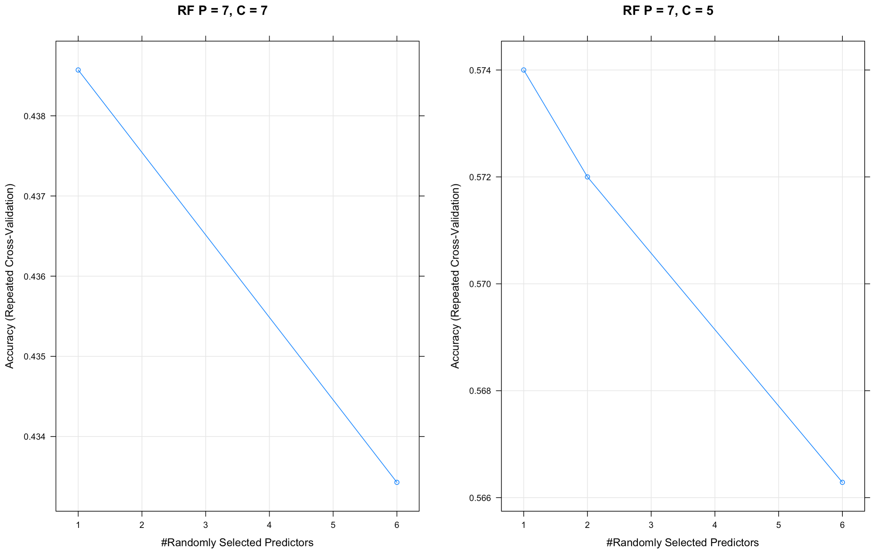
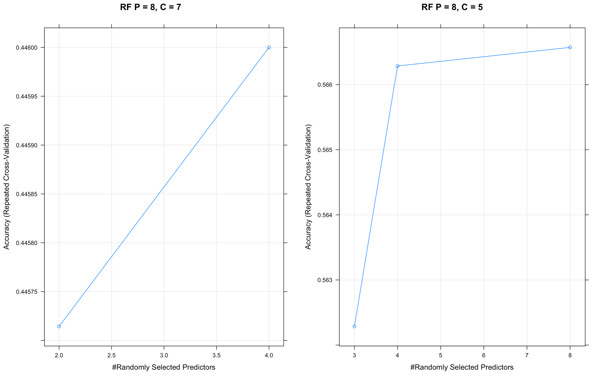
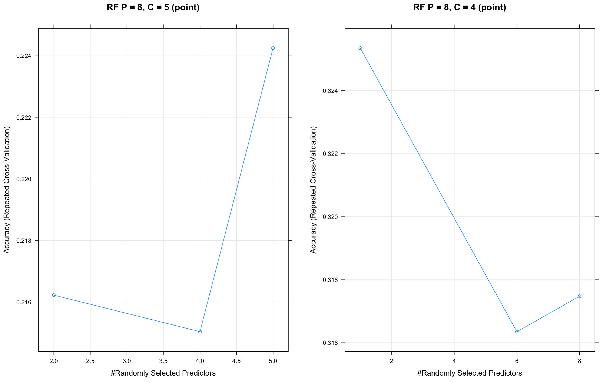
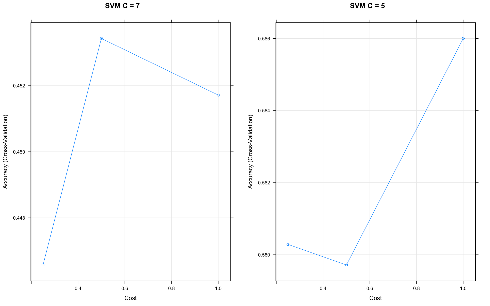
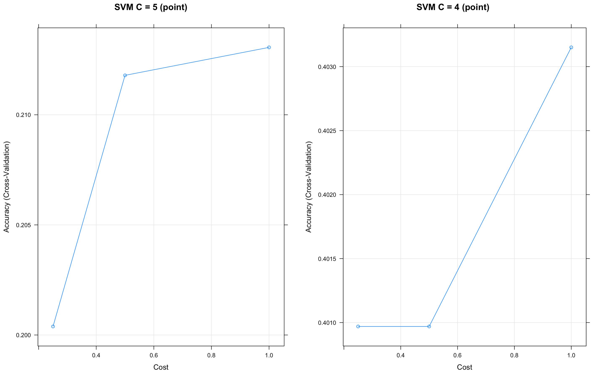
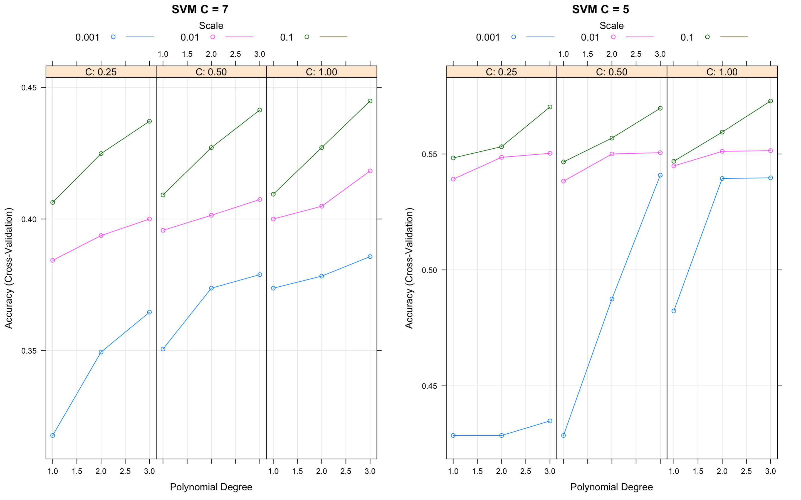
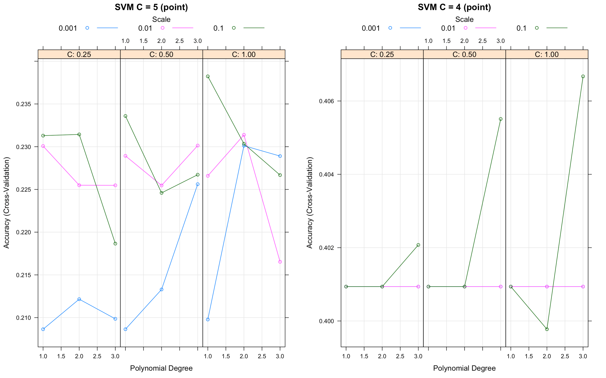

# Methods {#methods}

## Existing Methods

Since the Western redcedar decline is recent, there are currently no published work for identifying tree species like Western redcedars for the Pacific Northwest using satellite imaging. However, a similar study identifies tree species for a strip of land in California by combining ground-level data with satellite images [@fricker_convolutional_2019]. Their methods involved drawing polygons around rastered images that are layered with ground data as explained in Chapter \@ref(data), but the pixels from the polygons are used to train a convolutional neural network (CNN) model instead of the random forests and support vector machines in this study. The CNN model was then evaluated with k-fold cross validation. CNN models are appropriate in a classification setting and when working with satellite images because they account for spatial relations, which is likely to appear in classifying tree species. This study follows the methods of preparing the data for modelling as well as the method of cross validation to evaluate the performance of the random forests and support vector machines models. Random forests are used in a classification setting or regression setting and have the advantage of being simplier to train than CNN models and still performs at a similar level. Random forests use random feature selections to create decision trees and increase the number of correctly classified observations. Since this research strives to provide a computationally simple method of estimating tree locations to track changes in the ecosystem, a random forest is suitable for the study. If a researcher was interested in making more precise predictions, a CNN would require more time but would produce better estimates.

## Current Methods

This research applies RF and SVM models on trained data and compares overall training performance, overall testing performance, overall polygon testing accuracy, and Western Redcedar training and testing performance. The following sections provide background about RF and SVM models.

### Random Forest

In building a decision tree for classification, recursive binary splits are made by minimizing the Gini index ($G$), the total variance across $K$ classes:

$$G = \sum_{k = 1}^K\hat{p}_{mk}(1 - \hat{p}_{mk}),$$

where $\hat{p}_{mk}$ is the proportion of observations in the $m^{\text{th}}$ region from the $k^{\text{th}}$ class [@james_introduction_2013]. A small Gini index value represents a region containing mostly observations from a single class, while a large Gini index value represents a lot of variation across classes. Then the decision tree is constructed by repeatedly considering different attributes and making splits where the Gini index is minimized. Note that this top-down, greedy approach tends to overfit the training data, so finding the decision tree that performs the best on test data involves a cost-complexity pruning algorithm to obtain smaller trees and apply k-fold cross validation to choose the best tree that minimizes the average error. K-fold cross validation is performed when training the models by splitting the data into $k = 10$ folds and training ten models each time withholding one of the ten folds until the process goes through every fold. This process aids in understanding how the models will perform against data that has not been included in training the model. 

In the classification setting, a stronger predictive model than a decision tree is a random forest, which uses an element of randomness to decorrelate bootstrapped decision trees. Bootstrapped samples from the training dataset are used to construct decision trees, where splits are based on minimizing the Gini index when selecting from a random sample $m$ of attributes from all $p$ available. In common random forest applications, the number of attributes considered at a split is $m \approx \sqrt{p}$. Theoretically, by forcing only a subset of attributes to be featured in the tree, this expands the number of possible subtrees that might not have been achieved by the top-down, greedy approach. Hence, random forests provide a method of predicting classes with low variance while also keeping bias at a minimum.

### Support Vector Machine

Another method investigated in this study imagines the multidimensional data in space and classifies the data using hyperplanes positioned to minimize misclassification error and maximize distance from observations to separate the data [@james_introduction_2013]. Support vectors are vectors in space that represent the subset of observations which influence the hyperplane classifier. For example, in two dimensions, imagine a line separating A's one one side and B's on the other side. This line is the maximal margin hyperplane if it is the farthest possible from the observations and also separates the two classes perfectly. Observations that are closer to the hyperplane (support vectors) have more influence over the line if they move than observations that are further. Consequently, more support vectors indicates a classifier with lower variance and high bias. A tuning parameter can be altered to expand or shrink the margin of error surrounding the hyperplane (how far away the observations have to be from the plane) and decide the level of tolerance for misclassifying observations.

Support vector machines can be applied in a linear or nonlinear setting with the use of kernels. A kernel is a function $K(x_i, x_{i'})$ of two observations specifying the similarities between two points. Given data with $n$ observations, let $x_i$ be an observation, where $i = 1, ... ,n$. A linear kernel is 

$$K(x_i, x_{i'}) = \sum_{j = 1}^p x_{ij}x_{i'j}$$
with a support vector classifier

$$f(x) = \beta_0 + \sum_{i = 1}^n \alpha_i \langle x, x_i \rangle.$$

The parameters $\alpha_i$ and $\beta_0$ are estimated using the inner products of the observations, but $\alpha_i \neq 0$ if and only if $x_i$ is a support vector. Note that this function is similar to a linear regression function. Extending this model to a nonlinear context involves a similar approach as adding nonlinear terms to a regression model.

The polynomial kernel of degree $d$ is defined to be 

$$K(x_i, x_{i'}) = \left( 1 + \sum_{j = 1}^p x_{ij}x_{i'j}\right)^d$$

with support vector classifier

$$f(x) = \beta_0 + \sum_{i = 1}^n \alpha_i K(x, x_i).$$
For some positive constant $k$, the radial kernel is defined to be

$$K(x_i, x_{i'}) = \mbox{exp}\left( -\gamma\sum_{j = 1}^p(x_{ij} - x_{i'j})^2 \right),$$

which makes the support vector machine more sensitive to nearby observations as opposed to further observations. 

Support vector machines are less sensitive to outliers and successful predictors of categorical variables in high-dimensional data. A support vector machine does not perform well for data with observations that overlap and if the kernel is incorrectly selected.

## Training Models

Data used to train the RF and SVM models are the pixels training data and the point pixels training data. To prepare the data for modelling, first the data is separated into a training set and then a test set by a ratio of 70% training data and 30% testing data. The `dplyr` function `slice_sample` was used to take a stratified sample from the entire pixels dataset where 70% of each tree species in an individual raster strip was randomly selected. For example, the training set consisted of 70% of the bigleaf maple trees in raster strip 'A', 70% of bigleaf maple trees in raster strip 'B', and so on. From the 70% pixels training data, 500 observations for each tree species are extracted to obtain an even distribution of species. From the point pixels training data, 190 observations for each tree species are sampled.

The selected variables for training the models are the four bands (red, green, blue, infrared) and an NDVI variable, and the predictive variable is the tree species name. Some predictor variables were manually computed using ratios of bands. Typically, a long over short band ratio provides some more information to train the model. The following bands were created: red/blue, ir/red, red/green, and blue/green. Examining a correlation matrix with these predictors reveals possibly useful and not too highly correlated variables are red/green, red/blue, and blue/green (see Figure \@ref(fig:corrmatrix)).

```{r corrmatrix, results="asis", echo=FALSE, fig.cap="Correlation matrix of possible predictor variables to include in the model. Size and shade intensity represents stronger correlation (red/blue and blue are highly negatively correlated, while NDVI and green have almost no correlation). Positive correlation indicates higher values of one variable results in higher values of the other variable, while negative correlation indicates higher values of one variable results in lower values of the other variable.", out.width='70%', fig.align='center'}

```

To address the small number of predictor variables available to predict the large number of classes (7 tree species), some species are grouped together. The Bigleaf Maple, Norway Maple, and English Oak species are grouped under a new "Broadleaf" tree category. This reduces the number of classes to 5: Broadleaf, Douglas-Fir, Giant Sequoia, Grass, and Western Redcedar. Both the full 7 tree species training data and the grouped (5 class) species training data are used to train the models.

The `caret` package [@caret] in RStudio stands for classification and regression training, and it contains functions for facilitating the process of creating training models in R and determining the tuning parameters. 

### Random Forest Tuning

The `train` function from the `caret` package [@caret] with the specified `method = rf` option is used to train a random forest model on the training dataset to predict the tree species. The function takes parameters for data, the predictive variable, and the method of training the model. To perform k-fold cross validation, the `trainControl` function is used to create an object that tells the `train` function to perform cross validation 10 times with a different fold left out each time. The function automatically tries multiple number of tries at each split (mtry) and determines the optimal number through cross-validation. Training preliminary models with varying number of predictors provided a sense of the number of predictors to include in the training data that still add information to the model but avoid adding redundancy or multicollinearity to the model. For example, just having 5 predictors in the model results in a random forest that only selects one variable for each split, while 12 predictors guarantees an issue of multicollinearity. Models were considered with total predictors around 7 or 8 predicting classes of size 7 (individual species) or 5 (oaks and maples grouped together):

* 7 predictor model: red, green, blue, infrared, NDVI, $\frac{\mbox{red}}{\mbox{green}}$, $\frac{\mbox{blue}}{\mbox{green}}$

* 8 predictor model: red, green, blue, infrared, NDVI, $\frac{\mbox{red}}{\mbox{green}}$, $\frac{\mbox{red}}{\mbox{blue}}$, $\frac{\mbox{blue}}{\mbox{green}}$

<!-- #### 5 predictor Random Forest -->
<!-- Figure \@ref(fig:rf5) displays the accuracy of the trained random forest model for three different numbers of randomly selected predictors over 10 repeated cross-validation sets for a model with 5 predictors: red, green, blue, infrared, and NDVI band values. This model had the highest overall accuracy with 0.53 when mtry was 1. The variable with the highest predictive power was infrared band values followed by NDVI values. -->

<!-- ```{r rf5, results="asis", echo=FALSE, fig.cap='Accuracy of the 5 predictor trained random forest model for different mtry numbers over 10-fold cross-validation.', out.width='70%', fig.align='center'} -->
<!--  -->
<!-- ``` -->

#### 7 predictor Random Forest
The 7 predictor random forest model uses the following predictors: red, green, blue, infrared, NDVI, $\frac{\mbox{red}}{\mbox{green}}$ and $\frac{\mbox{blue}}{\mbox{green}}$ band values predictors. Figure \@ref(fig:rf7) displays the accuracy of the model predicting all 7 tree classes and the grouped 5 classes with the pixels training set with a range of mtry values. The 7 predictor model with the highest accuracy (determined by cross-validation) randomly selected 6 predictors at each split with an accuracy of 0.44. The variable with the highest predictive power was infrared band values with NDVI values with the second highest predictive power. For the grouped data, the optimal mtry value of 1 produced an accuracy of 0.57. The most important variable for this model was infrared followed by NDVI values.

```{r rf7, results="asis", echo=FALSE, fig.cap='Accuracy of the 7 predictor trained random forest model for different mtry numbers over 10-fold cross-validation on 7 class and 5 class training data. (P = Predictors, C = Classes)', out.width='90%', fig.align='center'}

```

#### 8 predictor Random Forest
The 8 predictor random forest model added a $\frac{\mbox{blue}}{\mbox{green}}$ predictor to the 7 predictor model. Figure \@ref(fig:rf8) displays the results of a different number of randomly selected predictors to be considered at each split in the tree for 7 class data and 5 class. For modelling all 7 classes, the optimal mtry value was 4 with an accuracy of 0.45. The variables with the higher predictive power in decreasing order were infrared, NDVI, and $\frac{\mbox{red}}{\mbox{green}}$ band values predictors. The model using grouped data with 5 tree classes, had an optimal mtry value of 8 with an accuracy of 0.57. The most important variable was infrared.

```{r rf8, results="asis", echo=FALSE, fig.cap='Accuracy of the 8 predictor trained random forest model for different mtry numbers over 10-fold cross-validation on 7 class and 5 class training data. (P = Predictors, C = Classes)', out.width='90%', fig.align='center'}

```

#### 8 predictor Random Forest on Point Pixels
A RF model was trained using the 8 predictors from the previous model on the point pixels data. According to Figure \@ref(fig:rf8c), for modelling all 5 classes (Bigleaf Maple, Douglas-Fir, Giant Sequoia, Norway Maple, Western Redcedar), the optimal mtry value was 5 with an accuracy of 0.22. The variables with the higher predictive power were $\frac{\mbox{red}}{\mbox{green}}$ and red band values predictors. The model using grouped data with 4 tree classes (Broadleaf, Douglas-Fir, Giant Sequoia, Western Redcedar), had an optimal mtry value of 1 with an accuracy of 0.33. The most important variable was $\frac{\mbox{red}}{\mbox{green}}$.

```{r rf8c, results="asis", echo=FALSE, fig.cap='Accuracy of the 8 predictor RF Model on point pixels data for different mtry numbers over 10-fold cross-validation on 5 class and 4 class training data. (P = Predictors, C = Classes)', out.width='90%', fig.align='center'}

```

#### Best Random Forest

Figure \@ref(fig:rfresults) compares the results of the models based on overall model accuracy in predicting the test data.

```{r rfresults, results="asis", echo=FALSE, fig.cap="Comparison of results from random forest models with different predictors included", out.width='90%', fig.align='center'}
include_graphics("figure/rfresults.png")
```

For modelling the 7 individual tree classes, the model with the 7 predictors included has a slightly higher maximum overall accuracy than the 8 predictor model. A confusion matrix located in (cite appendix) was constructed for each model averaging the entry counts over all ten cross validation resamples to investigate model performance just predicting Western Redcedar tree pixels. Both the 7 and the 8 predictor models performed similarly classifying Western Redceder pixels, the 7 predictor model had a prediction accuracy of 32%, the 8 predictor model had a prediction accuracy of 33%. Out of both models, Western Redcedars tend to be inaccurately classified under douglas-firs, english oak, and norway maple trees. The 8 predictor model trained on the point pixels data had a prediction accuracy of 29% for 5 class predictions. This model also misclassified Western Redcedars as norway maples, giant sequoias, and bigleaf maples.

Modelling only 5 tree classes by grouping some categories produced higher overall accuracies than the full classes models. The 7 predictor and 8 predictor model produced the highest overall average accuracies of 0.57 through cross-validation. The 7 predictor model and the 8 predictor model accurately predicted Western redcedars 36% and 35% of the time respectively. Most inaccurately predicted redcedars were classified under the broadleaf category. Models on both training sets predicted grass pixels with the highest accuracy. The 4 class model with the point pixel data had an overall accuracy of 0.33 with 0.25 Western Redcedar prediction accuracy.

Table \@ref(tab:resultsRF) compares the hyperparameters accross all random forest models.

```{r resultsRF, echo=F, warning=F, message=F, fig.cap='Chart', out.width='100%'}
results_r <- read.csv('~/tree_imaging/data/results_r.csv', check.names = F)

knitr::kable(results_r, "latex", caption = "Accuracy of random forest models with different number of predictors and mtry determined by ten-fold cross validation.")
```

### Support Vector Machine Tuning

The `train` function has the `method = svmLinear/svmRadial/svmPoly` option to train a SVM model on the dataset to classify pixels into species of trees. For multiple class SVM training on $k$ classes, this function classifies "one-against-one" by training $k(k - 1)/2$ binary classifiers. This option also has parameters for cost, loss function, class weights, and normalized variables. For this project, three support vector machines were trained: linear, radial basis, and polynomial basis, and the preprocess setting for all three models were specified to center and scale (in R: `preProcess = c("center", "scale")`), which standardizes the variables. This is commonly performed with SVM models because the scale of the variables influences the optimal hyperplane decision. Since the light intensities extracted from the band data are only positive values, it is reasonable to consider normalizing the variables by setting the maximum value in the variable to 1 and the minimum value to 0, however, in comparing the SVM models under this preprocess setting (in R: `preProcess = "range"`) to the standardized setting, the accuracy of the models is not as high as the accuracy of the standardized variable models. The `caret` package selects the best cost tuning parameters based on accuracy through cross-validation.

#### Linear Support Vector Machine
The linear kernel SVM model had the highest training accuracy at 0.41 when cost parameter held constant at a value of 1. The final model contained 3017 support vectors. The linear kernel SVM model on the 5 classes data held the cost parameter constant at 1 predicted the grouped tree classes with an accuracy of 0.55 contained 2739 support vectors. The SVM model with point pixel data had an accuracy of 0.23 with C = 1 and 866 support vectors on 5 class data. On 4 class data, the linear SVM model with point pixel data had a prediction accuracy of 0.40 with C = 1 and 837 support vectors.

#### Radial Support Vector Machine
Figure \@ref(fig:svm2) displays the results of different cost parameters on training accuracy for the radial basis kernel function on pixel data. The radial kernel SVM model on the 7 classes data set performed best when cost was 0.5 and $\sigma = 0.27$ for a training accuracy of 0.45. The final model had 2972 support vectors. The final values for the radial model on the 5 classes data set were $\sigma = 0.23$ and cost = 1 with an accuracy of 0.59 and 2630 support vectors. On the point pixels data, these values were C = 1, $\sigma = 0.32$, overall accuracy of 0.21, and 868 support vectors for the 5 class model. For the 4 class model on the point pixels data, the values were C = 0.1, accuracy of 0.40, and 849 vectors. See figure \@ref(fig:svm2c).

```{r svm2, results="asis", echo=FALSE, fig.cap="Comparison of accuracy results from different cost parameters for radial basis kernel function on pixel data.", out.width='90%', fig.align='center'}

```

```{r svm2c, results="asis", echo=FALSE, fig.cap="Comparison of accuracy results from different cost parameters for radial basis kernel function on point pixel data.", out.width='90%', fig.align='center'}

```

#### Polynomial Support Vector Machine
Figure \@ref(fig:svm3) displays the results of different cost parameters on training accuracy for the polynomial basis function kernel. The final values used for the model predicting 7 classes were degree = 3, scale = 0.1, and cost = 1, which corresponded to a training accuracy of 0.44. The final model had a total of 2959 support vectors. The final model predicting only 5 classes produced an accuracy of 0.57 under degree = 3, scale = 0.1, and cost = 1. This final model had 2643 support vectors. Figure \@ref(fig:svm3c) shows that the results for the point pixels data with 5 class predictions had an accuracy of 0.23 for degree = 1, scale = 0.1, cost = 1, and 869 support vectors. For 4 class predictions, the overall accuracy was 0.41 with degree = 3, scale = 0.1, cost = 0.1, and 852 support vectors.

```{r svm3, results="asis", echo=FALSE, fig.cap="Comparison of accuracy results from different cost parameters with scale ranging from 0.001 to 0.1, C from 0.25 to 1, and degree from 1 to 3 for polynomial SVM on pixel data.", out.width='90%', fig.align='center'}

```

```{r svm3c, results="asis", echo=FALSE, fig.cap="Comparison of accuracy results from different cost parameters with scale ranging from 0.001 to 0.1, C from 0.25 to 1, and degree from 1 to 3 for polynomial SVM on point pixel data.", out.width='90%', fig.align='center'}

```


#### Best Support Vector Machine

Figure \@ref(fig:svmresults) displays the results of the linear, radial basis, and polynomial basis support vector machine models. Based on the overall prediction accuracy, the radial basis is an appropriate kernel choice for the pixels data with the 5 class prediction.

```{r svmresults, results="asis", echo=FALSE, fig.cap="Comparison of results from support vector machine models with different kernel types: linear, radial, and polynomial.", out.width='90%', fig.align='center'}
include_graphics("figure/svmresults.png")
```

As with the random forest model comparisons, a confusion matrix was constructed using the average counts over all ten cross-validation resamples to obtain the model results predicting Western redcedars. The support vector machine model that performed best overall was the radial basis kernel model, and it had a prediction accuracy of 35% for the Western Redcedar class. The polynomial basis kernel had a 34% prediction accuracy and the linear kernel also had an accuracy of 33% for Western Redcedars. For Western redcedar prediction on the grouped classes, the radial model had 44% accuracy. The highest Western Redcedar prediction accuracy for SVM models with point pixel training data was for the polynomial basis model at 24%.

Table \@ref(tab:resultsSVM) compares the hyperparameters accross all support vector machine models. 

```{r resultsSVM, echo=F, warning=F, message=F, fig.cap='Chart', out.width='100%'}
results_s <- read.csv('~/tree_imaging/data/results_s.csv', check.names = F)

knitr::kable(results_s, "latex", caption = "Accuracy of support vector machine models with different kernels. Best parameter is determined by ten-fold cross validation.")
```

## Testing Models

A subset of the data was withheld from training the models as test data to provide some measure of how the models perform in predicting results that the answer is unknown. Based on overall and redcedar accuracy, the appropriate models to consider with the testing data are the 5 class 7 predictor RF and the 5 class radial SVM. The results for the overall test accuracy and the prediction test accuracy for Western redcedars are shown in Tables \@ref(tab:resultsTest) and \@ref(tab:resultsTest2).

```{r resultsTest, echo=F, warning=F, message=F, fig.cap='Chart', out.width='100%'}
test_results <- read.csv('~/tree_imaging/data/test_results.csv', check.names = F)

results_tab <- test_results %>%
  summarise("RF Accuracy" = sum(Class == RF)/nrow(test_results), 
            "SVM Accuracy" = sum(Class == SVM)/nrow(test_results))

knitr::kable(results_tab, "latex", caption = "Overall accuracy of 7 predictor RF (5 class) and Radial SVM (5 class) models on test data")
```

```{r resultsTest2, echo=F, warning=F, message=F, fig.cap='Chart', out.width='100%'}
test_results_redceder <- test_results %>%
  dplyr::filter(Class %in% "Western Redcedar")

results_redcedar_tab <- test_results_redceder %>%
  summarise(rf_accuracy = sum(Class == RF)/nrow(test_results_redceder), 
            svm_accuracy = sum(Class == SVM)/nrow(test_results_redceder))

knitr::kable(results_redcedar_tab, "latex", caption = "Western redcedar accuracy of 7 predictor RF (5 class) and Radial SVM (5 class) models on test data")
```

According to the test data, the best performing models for further analysis are the radial SVM model for 5 class prediction and the 7 predictor RF model for 5 class prediction.

The polygon prediction accuracy on the test dataset was also computed to see how pixels of the same tree were classified compared to individual pixel classification. A "correct" prediction was indicated if more than half the pixels in a polygon are correctly predicted. Table \@ref(tab:polyTab) displays the results over polygons in the test dataset.

```{r polyTab, echo=F, warning=F, message=F, fig.cap='Chart', out.width='100%'}
poly_test_rf <- read.csv('~/tree_imaging/data/poly_test_rf.csv', check.names = F)
poly_test_svm <- read.csv('~/tree_imaging/data/poly_test_svm.csv', check.names = F)

poly_test_rf <- poly_test_rf %>%
  group_by(Result) %>%
  count(Result)
poly_test_svm <- poly_test_svm %>%
  group_by(Result) %>%
  count(Result)

poly_results <- cbind(Type = c("SVM C = 5", "SVM C = 5", "RF P = 7, C = 5", "RF P = 7, C = 5"), 
                      rbind(poly_test_svm, poly_test_rf))


knitr::kable(poly_results, "latex", caption = "Accuracy of radial SVM model with 5 classes and 7 predictor RF model with 5 classes for polygons in test data. A correct prediction is considered to be a polygon with more than half of the pixels correctly classified.")
```

```{r include_packages_2, include = FALSE}
# This chunk ensures that the thesisdown package is
# installed and loaded. This thesisdown package includes
# the template files for the thesis and also two functions
# used for labeling and referencing
if (!require(remotes)) {
  if (params$`Install needed packages for {thesisdown}`) {
    install.packages("remotes", repos = "https://cran.rstudio.com")
  } else {
    stop(
      paste(
        'You need to run install.packages("remotes")',
        "first in the Console."
      )
    )
  }
}
if (!require(dplyr)) {
  if (params$`Install needed packages for {thesisdown}`) {
    install.packages("dplyr", repos = "https://cran.rstudio.com")
  } else {
    stop(
      paste(
        'You need to run install.packages("dplyr")',
        "first in the Console."
      )
    )
  }
}
if (!require(ggplot2)) {
  if (params$`Install needed packages for {thesisdown}`) {
    install.packages("ggplot2", repos = "https://cran.rstudio.com")
  } else {
    stop(
      paste(
        'You need to run install.packages("ggplot2")',
        "first in the Console."
      )
    )
  }
}
if (!require(bookdown)) {
  if (params$`Install needed packages for {thesisdown}`) {
    install.packages("bookdown", repos = "https://cran.rstudio.com")
  } else {
    stop(
      paste(
        'You need to run install.packages("bookdown")',
        "first in the Console."
      )
    )
  }
}
if (!require(thesisdown)) {
  if (params$`Install needed packages for {thesisdown}`) {
    remotes::install_github("ismayc/thesisdown")
  } else {
    stop(
      paste(
        "You need to run",
        'remotes::install_github("ismayc/thesisdown")',
        "first in the Console."
      )
    )
  }
}
library(thesisdown)
library(dplyr)
library(ggplot2)
library(knitr)
flights <- read.csv("data/flights.csv", stringsAsFactors = FALSE)
```


<!-- # Tables, Graphics, References, and Labels {#ref-labels} -->

<!-- ## Tables -->

<!-- In addition to the tables that can be automatically generated from a data frame in **R** that you saw in [R Markdown Basics] using the `kable()` function, you can also create tables using _pandoc_. (More information is available at <https://pandoc.org/README.html#tables>.)  This might be useful if you don't have values specifically stored in **R**, but you'd like to display them in table form.  Below is an example.  Pay careful attention to the alignment in the table and hyphens to create the rows and columns. -->

<!-- ---------------------------------------------------------------------------------- -->
<!--   Factors                    Correlation between Parents & Child      Inherited -->
<!-- ------------------------- ----------------------------------------- -------------- -->
<!--   Education                                -0.49                         Yes -->

<!--   Socio-Economic Status                     0.28                        Slight    -->

<!--   Income                                    0.08                          No -->

<!--   Family Size                               0.18                        Slight -->

<!--   Occupational Prestige                     0.21                        Slight -->
<!-- ------------------------- ----------------------------------------- -------------- -->
<!-- Table: (\#tab:inher) Correlation of Inheritance Factors for Parents and Child  -->

<!-- We can also create a link to the table by doing the following: Table \@ref(tab:inher).  If you go back to [Loading and exploring data] and look at the `kable` table, we can create a reference to this max delays table too: Table \@ref(tab:maxdelays). The addition of the `(\#tab:inher)` option to the end of the table caption allows us to then make a reference to Table `\@ref(tab:label)`. Note that this reference could appear anywhere throughout the document after the table has appeared.   -->

<!-- We will next explore ways to create this label-ref link using figures. -->

<!-- \clearpage -->

<!-- clearpage ends the page, and also dumps out all floats.
  Floats are things like tables and figures. -->


<!-- ## Figures -->

<!-- If your thesis has a lot of figures, _R Markdown_ might behave better for you than that other word processor.  One perk is that it will automatically number the figures accordingly in each chapter.    You'll also be able to create a label for each figure, add a caption, and then reference the figure in a way similar to what we saw with tables earlier.  If you label your figures, you can move the figures around and _R Markdown_ will automatically adjust the numbering for you.  No need for you to remember!  So that you don't have to get too far into LaTeX to do this, a couple **R** functions have been created for you to assist.  You'll see their use below. -->

<!--
One thing that may be annoying is the way _R Markdown_ handles "floats" like tables and figures (it's really \LaTeX's fault). \LaTeX\ will try to find the best place to put your object based on the text around it and until you're really, truly done writing you should just leave it where it lies. There are some optional arguments specified in the options parameter of the `label` function.  If you need to shift your figure around, it might be good to look here on tweaking the options argument:  <https://en.wikibooks.org/wiki/LaTeX/Floats,_Figures_and_Captions>

If you need a graphic or tabular material to be part of the text, you can just put it inline. If you need it to appear in the list of figures or tables, it should be placed in a code chunk.
-->


<!-- In the **R** chunk below, we will load in a picture stored as `reed.jpg` in our main directory.  We then give it the caption of "Reed logo", the label of "reedlogo", and specify that this is a figure.  Make note of the different **R** chunk options that are given in the R Markdown file (not shown in the knitted document). -->

<!-- ```{r reedlogo, fig.cap="Reed logo"} -->
<!-- include_graphics(path = "figure/reed.jpg") -->
<!-- ``` -->

<!-- Here is a reference to the Reed logo: Figure \@ref(fig:reedlogo).  Note the use of the `fig:` code here.  By naming the **R** chunk that contains the figure, we can then reference that figure later as done in the first sentence here.  We can also specify the caption for the figure via the R chunk option `fig.cap`. -->

<!-- \clearpage  -->

<!-- starts a new page and stops trying to place floats such as tables and figures -->

<!-- Below we will investigate how to save the output of an **R** plot and label it in a way similar to that done above.  Recall the `flights` dataset from Chapter \@ref(rmd-basics).  (Note that we've shown a different way to reference a section or chapter here.)  We will next explore a bar graph with the mean flight departure delays by airline from Portland for 2014. -->

<!-- ```{r delaysboxplot, warnings=FALSE, messages=FALSE, fig.cap="Mean Delays by Airline", fig.width=6} -->
<!-- mean_delay_by_carrier <- flights %>% -->
<!--   group_by(carrier) %>% -->
<!--   summarize(mean_dep_delay = mean(dep_delay)) -->
<!-- ggplot(mean_delay_by_carrier, aes(x = carrier, y = mean_dep_delay)) + -->
<!--   geom_bar(position = "identity", stat = "identity", fill = "red") -->
<!-- ``` -->

<!-- Here is a reference to this image: Figure \@ref(fig:delaysboxplot). -->

<!-- A table linking these carrier codes to airline names is available at <https://github.com/ismayc/pnwflights14/blob/master/data/airlines.csv>. -->

<!-- \clearpage -->

<!-- Next, we will explore the use of the `out.extra` chunk option, which can be used to shrink or expand an image loaded from a file by specifying `"scale= "`. Here we use the mathematical graph stored in the "subdivision.pdf" file. -->

<!-- ```{r subd, results="asis", echo=FALSE, fig.cap="Subdiv. graph", out.extra="scale=0.75"} -->
<!-- include_graphics("figure/subdivision.pdf") -->
<!-- ``` -->

<!-- Here is a reference to this image: Figure \@ref(fig:subd).  Note that `echo=FALSE` is specified so that the **R** code is hidden in the document. -->

<!-- **More Figure Stuff** -->

<!-- Lastly, we will explore how to rotate and enlarge figures using the `out.extra` chunk option.  (Currently this only works in the PDF version of the book.) -->

<!-- ```{r subd2, results="asis", echo=FALSE, out.extra="angle=180, scale=1.1", fig.cap="A Larger Figure, Flipped Upside Down"} -->
<!-- include_graphics("figure/subdivision.pdf") -->
<!-- ``` -->

<!-- As another example, here is a reference: Figure \@ref(fig:subd2).   -->

<!-- ## Footnotes and Endnotes -->

<!-- You might want to footnote something. ^[footnote text] The footnote will be in a smaller font and placed appropriately. Endnotes work in much the same way. More information can be found about both on the CUS site or feel free to reach out to <data@reed.edu>. -->

<!-- ## Bibliographies -->

<!-- Of course you will need to cite things, and you will probably accumulate an armful of sources. There are a variety of tools available for creating a bibliography database (stored with the .bib extension).  In addition to BibTeX suggested below, you may want to consider using the free and easy-to-use tool called Zotero.  The Reed librarians have created Zotero documentation at <https://libguides.reed.edu/citation/zotero>.  In addition, a tutorial is available from Middlebury College at <https://sites.middlebury.edu/zoteromiddlebury/>. -->

<!-- _R Markdown_ uses _pandoc_ (<https://pandoc.org/>) to build its bibliographies.  One nice caveat of this is that you won't have to do a second compile to load in references as standard LaTeX requires. To cite references in your thesis (after creating your bibliography database), place the reference name inside square brackets and precede it by the "at" symbol.  For example, here's a reference to a book about worrying:  [@Molina1994].  This `Molina1994` entry appears in a file called `thesis.bib` in the `bib` folder.  This bibliography database file was created by a program called BibTeX.  You can call this file something else if you like (look at the YAML header in the main .Rmd file) and, by default, is to placed in the `bib` folder.   -->

<!-- For more information about BibTeX and bibliographies, see our CUS site (<https://web.reed.edu/cis/help/latex/index.html>)^[@reedweb2007]. There are three pages on this topic:  _bibtex_ (which talks about using BibTeX, at <https://web.reed.edu/cis/help/latex/bibtex.html>), _bibtexstyles_ (about how to find and use the bibliography style that best suits your needs, at <https://web.reed.edu/cis/help/latex/bibtexstyles.html>) and _bibman_ (which covers how to make and maintain a bibliography by hand, without BibTeX, at <https://web.reed.edu/cis/help/latex/bibman.html>). The last page will not be useful unless you have only a few sources. -->

<!-- If you look at the YAML header at the top of the main .Rmd file you can see that we can specify the style of the bibliography by referencing the appropriate csl file.  You can download a variety of different style files at <https://www.zotero.org/styles>.  Make sure to download the file into the csl folder.   -->

<!-- Fill the rest of the page with the content below for the PDF version. -->

<!-- \vfill -->

<!-- **Tips for Bibliographies** -->

<!-- - Like with thesis formatting, the sooner you start compiling your bibliography for something as large as thesis, the better. Typing in source after source is mind-numbing enough; do you really want to do it for hours on end in late April? Think of it as procrastination. -->
<!-- - The cite key (a citation's label) needs to be unique from the other entries. -->
<!-- - When you have more than one author or editor, you need to separate each author's name by the word "and" e.g. `Author = {Noble, Sam and Youngberg, Jessica},`. -->
<!-- - Bibliographies made using BibTeX (whether manually or using a manager) accept LaTeX markup, so you can italicize and add symbols as necessary. -->
<!-- - To force capitalization in an article title or where all lowercase is generally used, bracket the capital letter in curly braces. -->
<!-- - You can add a Reed Thesis citation^[@noble2002] option. The best way to do this is to use the phdthesis type of citation, and use the optional "type" field to enter "Reed thesis" or "Undergraduate thesis."  -->

<!-- ## Anything else? -->

<!-- If you'd like to see examples of other things in this template, please contact the Data @ Reed team (email <data@reed.edu>) with your suggestions. We love to see people using _R Markdown_ for their theses, and are happy to help. -->

