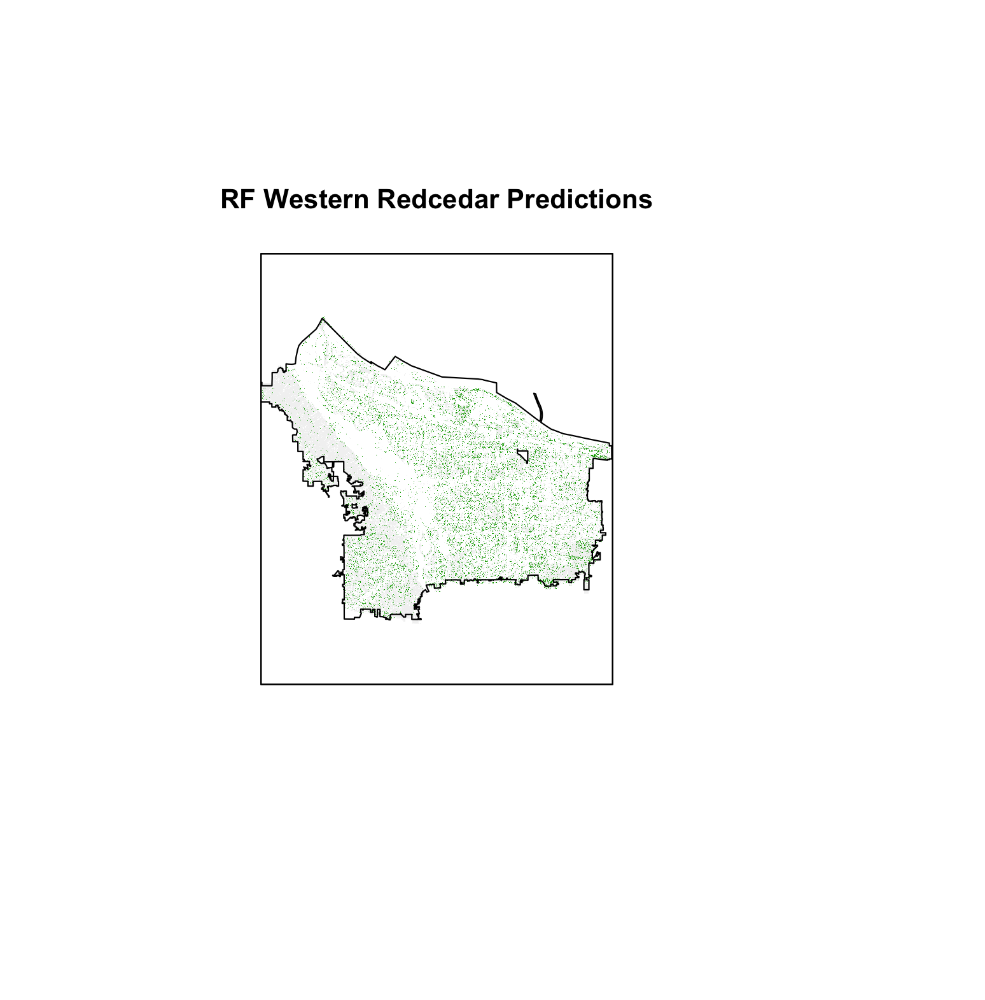
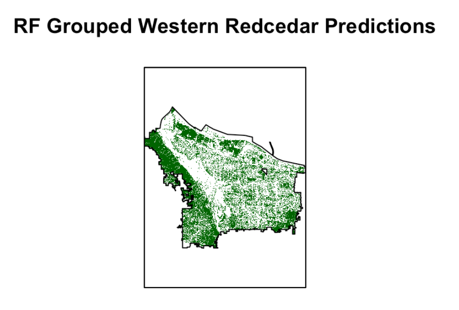
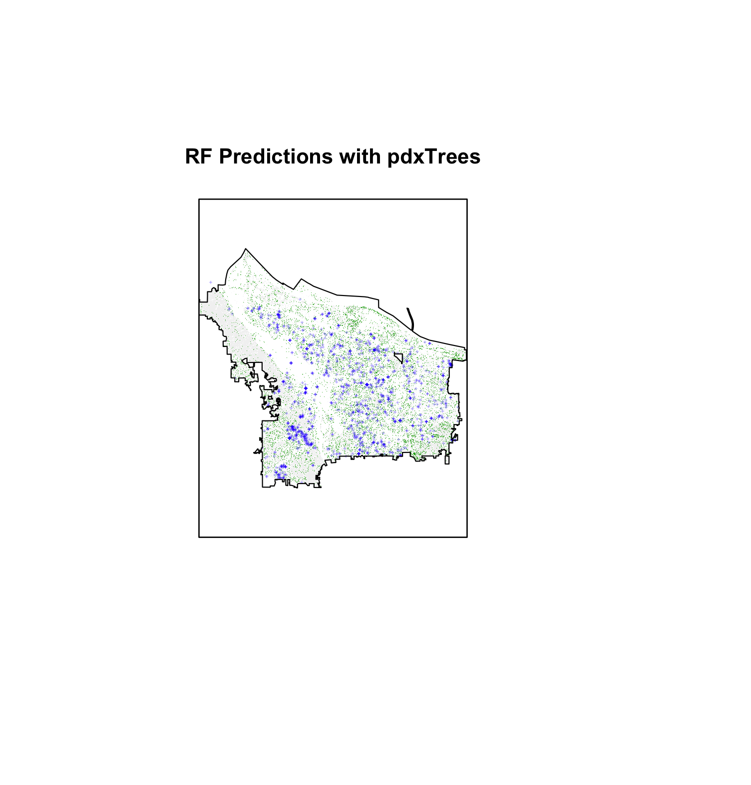

# Results {#results}

## Training Results

Predicting on the grouped data produced the highest overall accuracies. The best model on the grouped data was the random forest training model with an mtry value of 1 predictor at each split and the following predictors: red, green, blue, infrared, NDVI, $\frac{\mbox{red}}{\mbox{green}}$, $\frac{\mbox{red}}{\mbox{blue}}$, $\frac{\mbox{blue}}{\mbox{green}}$. This model had a training predictive accuracy of 0.65 overall and 0.42 for Western redcedars specifically. On the test dataset, this model still accurately predicted 64% of the pixels, while the accuracy for predicting more than half the pixels correctly in the same polygon was 52%. 

The model that performed best at predicting all 7 tree classes was the radial SVM model with cost equal to 16 and $\sigma = 0.25$. The radial support vector machine had a training accuracy of 0.56 overall, 0.37 for just Western redcedars, and testing accuracy of 0.55 overall and 0.33 for Western redcedar pixels. For polygon predictions, the radial support vector machine had an accuracy of 32%. Between the 8 predictor RF model on the 5 classes data and the radial SVM model on the 7 classes data, the RF model outperforms the SVM model. This model is used to proceed with the final model over Portland.

## Modelling Tree Species in Portland

After masking the raster images of the entire region of Portland, the pre-trained models are used to predict the tree species of individual pixels in the masked raster images. The `predict.raster` function from RStudio's `raster` package takes a model and applies that model to each cell of the raster, leaving a raster with tree classification predictions. This function is used to predict tree species over all five raster strips, and the raster strips are merged to display predictions for the entire city. Figure \@ref(fig:rfPortland) displays the tree classification predictions given by the optimal random forest model over Portland and figure \@ref(fig:rfPortlandGroup) displays the predictions from the support vector machine model.

```{r rfPortland, results="asis", echo=FALSE, fig.cap="Model tree classification predictions of Western Redcedars over entire Portland region using the random forest model with 8 predictors on 7 classes.", out.width='100%', fig.align='center'}

```

```{r rfPortlandGroup, results="asis", echo=FALSE, fig.cap="Model tree classification predictions of Western Redcedars over entire Portland region using RF model with 7 predictors on 5 classes.", out.width='100%', fig.align='center'}

```

In comparing the RF C = 5 model results to the RF C = 7 results, 83% of the pixel predictions were the same predictions under both models.

To assess the performance of the model over the Portland region, the results are compared to the remaining Western redcedars from `pdxTrees` both street and park data. The shapefiles for `pdxTrees` Western redcedars ground data are mapped over the classified pixel predictions, and the number of correctly and incorrectly classified pixels is recorded to be 52% accurate for RF C = 7 and 66% for RF C = 7. Figure \@ref(fig:resultsToStreet) visualizes this comparison.

```{r resultsToStreet, results="asis", echo=FALSE, fig.cap="Comparison of Wester redcedar RF pixel predictions (in green) to Western redcedar trees from pdxTrees (in blue).", out.width='100%', fig.align='center'}

```

# Discussion {#discussion}

## RF Grouped Data Performance Versus SVM Full Data Performance
The RF model predicting 5 classes outperforms the SVM model predicting all 7 classes in training and testing overall accuracy as well as in prediction of the whole polygons. It was observed that the models predicting less classes (Broadleaf, Douglas-Fir, Giant Sequoia, Grass, and Western Redcedar) outperformed models predicting on a larger set of tree classes (Bigleaf Maple, English Oak, Norway Maple, Douglas-Fir, Giant Sequoia, Grass, and Western Redcedar). This is likely a result of only having 4-band imagery plus the variables that are linear combinations of these 4 bands; 8 predictors training a model to predict 7 classes will not predict as well as 8 predictors training a model to predict 5 classes. In comparing the entire RF results on Portland to the `pdxTrees`, the test accuracy was 0.65.

## Model Results Compared to Fricker Methods [@fricker_convolutional_2019]
Fricker's methods are conducted under ideal circumstances. The single image strip used in the study had a spatial resolution of 1 meter, they had access to both hyperspectral imagery and RGB imagery, and the ground data was carefully collected to consist of seven tree species [@fricker_convolutional_2019]. Fricker's results show that models using hyperspectral images performed better than RGB image models because they provide additional information by including spectral band combinations not available from RGB images. For this research, the images only consist of 4 bands (red, green, blue, and infrared), are accessible online, and have a spatial resolution of 3 meters. Fricker's methods applying a convolution neural network using hyperspectral imagery produced cross-validation training accuracies of 87%. On just RGB imagery, this accuracy dropped to 64%, which is slightly less than the best performing model (RF P = 8, C = 5) from this research which had a cross-validation training accuracy of 65%.

## Methods of Improvement/Further Work
As Fricker's article has shown, increasing the spectral resolution by having access to hyperspectral data adds more information to the models and improves performance.  Hyperspectral imagery collects information from more regions of the spectrum than RGB imagery, which allows it to capture finer details. Tree and vegetation pixels reflect a certain amount of light, especially regions of dense forests, so having more bands can allow the models to detect subtle differences in vegetation pixels with non-vegetation pixels. By increasing the number of variables in the model, the risk of multicollinearity that comes from artificially creating predictors with linear combinations of the RGB bands also gets removed. The benefits of high spatial and spectral resolution imagery also extends to improving the masks applied to the images, which were successful, for example, in removing building structures and dead fields of grass, but incorrectly recognized mossy lakes as trees. Carefully masking the images improves the ability of the model to locate tree pixels and classify them.

In terms of data, another improvement to this research would be to increase the spatial resolution to 1 meter or better if possible. This refines the process of creating polygons by enhancing the visibility of the tree canopy outlines and reduces noise introduced by having shadows, dirt, building structures, and other non-tree pixels within the polygons. Another method to improve the results is by improving the drawn polygons themselves to only include pixels that represent the tree canopy. Drawing the polygons for each tree species by hand is likely to introduce error to the analysis because the first few polygons are not likely to be drawn the same way that the last few polygons are drawn. This issue is addressed by taking care to only include pure tree pixels (no shadows, dirt, or other structures) and ensuring that each polygon consists of at least 10 pixels.

An ideal training data set for the models would consist of data from imagery with high spatial and spectral resolution and also polygons with pure tree canopy pixels. If multiple raster strips are neccessary for the area of interest, the polygons need to be evenly distributed across all raster strips and ideally the tree species per polygon as well. The trees themselves should have large canopies that hopefully do not overlap with other tree canopies of different species.

With these improvements, the research will allow researchers to have a better understanding of the locations of redcedars in Portland. From there, this information provides a way to track future changes in redcedar trees's health, and inform decisions about tree management in the city. In a broader context, applying this method to Portland imagery data with multiple strips provides information about the applicability of modelling tree locations in different parts of the world and with data from different satellites. Ultimately, tracking the changes of the ecosystem allows people to take steps to preserve dying species.

## Conclusion

Reports of Western redcedars in the Pacific Northwest over the past 10 years have sparked an interest in investigating the decline of the species. This research combined RGB imagery and ground-level data available for the city of Portland to try and predict the locations of Western redcedars and progress towards understanding the decline of the species and eventually expand the methods to larger regions like the Pacific Northwest. Ground-level data was used to locate individual tree canopies and label their species on the satellite images, then the light intensities were extracted for each tree canopy pixel into a training data set. Random forest and support vector machine models were trained to classify 7 or 5 tree species. The best performing model was the random forest model with 7 predictors on 5 tree species with an F-score of 0.5 for Western redcedars. These results were not as high as other results from data with better conditions (higher spatial and spectral resolutions). However, they provide a slightly better way of classifying a tree pixel as Western redcedar than guessing one of the 7 species.

The results of this research are replicable, since it involves data from open sources and the coding is completed in RStudio, and not too computationally intensive to require more than a day to run all of the code. A key takeaway is that this research applies the methods of using remote sensing imagery to classify tree species in Portland specifically and provides a guideline for general areas to focus on locating Western redcedars. 

<!-- If we don't want Conclusion to have a chapter number next to it, we can add the `{-}` attribute. -->

<!-- **More info** -->

<!-- And here's some other random info: the first paragraph after a chapter title or section head _shouldn't be_ indented, because indents are to tell the reader that you're starting a new paragraph. Since that's obvious after a chapter or section title, proper typesetting doesn't add an indent there. -->

