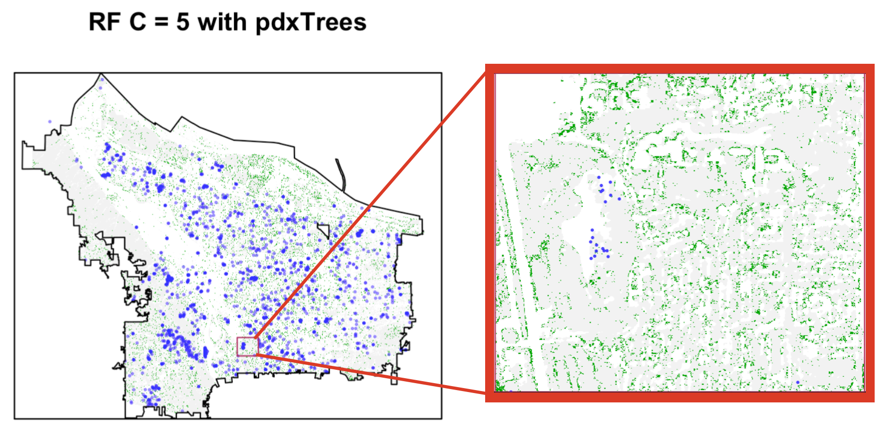

# Results {#results}

## Training Results

Predicting on the grouped data produced the highest overall accuracies. The best model on the grouped data was the RF training model with an mtry value of 3 predictors at each split and the following predictors: red, green, blue, infrared, NDVI, $\frac{\mbox{red}}{\mbox{green}}$, $\frac{\mbox{red}}{\mbox{blue}}$. This model had a training predictive accuracy of 0.57 overall and 0.36 for Western Redcedars specifically. On the test dataset, this model accurately predicted 65% of the pixels, 22% of Western Redcedars, while the accuracy for predicting more than half the pixels correctly in the same polygon was 52%. 

The model that performed best among SVM models was the radial SVM on 5 class data. This model had a training accuracy of 0.59 overall, 0.35 for just Western Redcedars, and testing accuracy of 0.66 overall and 0.11 for Western Redcedar pixels. For polygon predictions, the radial SVM C = 5 model had an accuracy of 54%. Both models perform similarly, however, for Western Redcedar predictions, the RF model outperforms the SVM model. These models are used to proceed with the final model over Portland.

## Modelling Tree Species in Portland

After masking the raster images of the entire region of Portland by NDVI values, the pre-trained models are used to predict the tree species of individual pixels in the masked raster images. The `predict.raster` function from RStudio's `raster` package takes a model and applies that model to each cell of the raster, leaving a raster with tree classification predictions. This function is used to predict tree species over all five raster strips, and the raster strips are merged to display predictions for the entire city. Figure \@ref(fig:rfPortlandRF) displays the tree classification predictions given by the optimal random forest model over Portland and figure \@ref(fig:rfPortlandSVM) displays the predictions from the support vector machine model.

```{r rfPortlandRF, results="asis", echo=FALSE, fig.cap="Model tree classification predictions of Western Redcedars over entire Portland region using the random forest model with 7 predictors on 5 classes.", out.width='100%', fig.align='center'}
include_graphics("figure/rfPortland.png")
```

```{r rfPortlandSVM, results="asis", echo=FALSE, fig.cap="Model tree classification predictions of Western Redcedars over entire Portland region using radial SVM C = 5.", out.width='100%', fig.align='center'}
include_graphics("figure/svmPortland.png")
```

In comparing the RF P = 7, C = 5 model results to the radial SVM C = 5 results, 91% of the Western Redcedar pixel predictions were the same predictions under both models.

To assess the performance of the model over the Portland region, the results are compared to the remaining Western Redcedars from `pdxTrees` both street and park data. The shapefiles for `pdxTrees` Western Redcedars ground data are mapped over the classified pixel predictions, and the number of correctly and incorrectly classified pixels is recorded to be 57% accurate for RF P = 7, C = 5 and 63% accurate for radial SVM C = 5. Figure \@ref(fig:resultsToStreet) visualizes this comparison for RF P = 7, C = 5.

```{r resultsToStreet, results="asis", echo=FALSE, fig.cap="Comparison of Wester redcedar RF pixel predictions (in green) to Western Redcedar trees from pdxTrees (in blue).", out.width='100%', fig.align='center'}

```

As part of the research seeks to investigate whether tree prediction outside of Portland's Tree Inventory Project is possible, Figure \@ref(fig:reedTreesTopdx) presents a side-by-side comparison of tree predictions for trees in proximity to Reed College. As part of the Tree Inventory Project, the trees are mapped on a satellite image at a higher resolution than used in this research, and the left image in Figure \@ref(fig:reedTreesTopdx) displays which trees are included in the citywide study [@noauthor_tree_nodate]. The right image in Figure \@ref(fig:reedTreesTopdx) displays model predictions for trees in the same region. Pixels in green accurately indicate grass pixels as the fields of grass in the Eastmoreland Golf Course location. There are also trees outlining some of the golf courses, which can be cross-checked with the satellite image on the left. The trees in the golf course were not inventoried by the field crew, so this research successfully identifies trees not already included in the Inventory Project. In the satellite image, Reed College is displayed by the centered clusters of white rectangles just above the rows of green circles. Note that trees on Reed's campus were not inventoried, but that the model predictions in the right image suggest that Western Redcedars can be located around campus. An extension of this research would be determining how accurately the trees are classified by sending out field crews to record information around campus.

```{r reedTreesTopdx, results="asis", echo=FALSE, fig.cap="Comparison of tree model predictions (right) with pdxTrees (left) around Reed College. On the left, the circles mark the locations of pdxTrees, with color and shape indicating tree species and size according to the settings found on the website ('Tree Inventory Project'). On the right, the different colored pixels represent model predictions.", out.width='100%', fig.align='center'}

```

# Discussion {#discussion}

## Polygon Pixel Extraction Versus Point Pixel Extraction
Following along with the Fricker Methods [@fricker_convolutional_2019], a training dataset is constructed with multiple pixels from a single tree (extracted from the polygon shape). Another dataset was included in the methods of this research constructed with single pixels representing individual trees to investigate how the methods compare. Especially with low-resolution imagery, this analysis questions whether several pixels representing one tree in training a model is more beneficial than having a single pixel representing one tree (where that pixel is the center location of the tree's canopy). In terms of overall accuracies, the point pixel models did not perform as well as the pixel models. The most comparable Western Redcedar prediction accuracy among the point pixel models was the RF P = 8, C = 5 model, which was 0.29, which is low compared to the radial SVM C = 5 model on pixel data with 0.44 Western Redcedar accuracy, but close to the RF C = 7 models which predicted around 0.33 for Western Redcedars. The other point pixel models performed worse in overall validation accuracy, suggesting that polygon pixel extraction provides more information to train the model with more accuracy. One explanation for this discrepancy is that the field data from `pdxTrees` does not perfectly line up with tree locations on the satellite images, and this is especially true for smaller trees. Larger trees tend to have canopies that extend over the point pixel location, making up for the error in the point representing the tree's marked location. On the other hand, smaller trees (especially with canopies less than 3 meters across) are not centered around the point pixel, instead they tend to be about a pixel away. Extracting these pixel values is likely extracting the values of the street, sidewalk, shadow, grass, or other structure instead of the desired tree pixel. This analysis reveals how the model performance is sensitive to the training data going into the model, which emphasizes the importance of accurate field work. A potential improvement could be to relocate the point pixels so that they are perfectly centered over the tree canopies, however, this approach would be time-consuming.

## RF Performance Versus SVM Performance
The 7 predictor RF model predicting 5 classes outperforms the SVM model predicting 5 classes in Western Redcedar training accuracy and testing overall accuracy as well as testing prediction of Western Redcedars. Surprisingly, the overall testing accuracies were higher than the validation accuracies for both the RF and SVM models. This suggests that the training set was not representative of the true data or the model was underfitting the data. The SVM model performs significantly worse than the RF model in Western Redcedar predictions on the test data. This could be a reflection of the fact that, by nature, SVM models perform poorly with data that have a lot of overlap and the pixel densities in Figure \@ref(fig:pixDensity) appear to be similar, so observations will have overlap. One other explanation might be that the validation Western Redcedar accuracy aggregates the results of all 10 cross-validation sets, which inflates the values, but the test results only consists of one set. Another explanation could be that the lower testing accuracy is an indication of model overfitting, however, the overall testing accuracy is higher than the overall training accuracy. In general, having a small number of predictors compared to the number of classes tends to perform poorly. It was also observed that the models predicting less classes (Broadleaf, Douglas-Fir, Giant Sequoia, Grass, and Western Redcedar) outperformed models predicting on a larger set of tree classes (Bigleaf Maple, English Oak, Norway Maple, Douglas-Fir, Giant Sequoia, Grass, and Western Redcedar). This is likely a result of only having 4-band imagery plus the variables that are linear combinations of these 4 bands; 8 predictors training a model to predict 7 classes will not predict as well as 8 predictors training a model to predict 5 classes. In comparing the entire RF results on Portland to the `pdxTrees`, the test accuracy was 0.57. Since this is only using Western Redcedar trees from `pdxTrees`, the accuracy does not provide a true interpretation of how well the model performs on prediction locations and species for trees that were excluded from Portland's Inventory Project.

## Model Results Compared to Fricker Methods [@fricker_convolutional_2019]
Fricker's methods are conducted under ideal circumstances. The single image strip used in the study had a spatial resolution of 1 meter, they had access to both hyperspectral imagery and RGB imagery, and the ground data was carefully collected to consist of seven tree species [@fricker_convolutional_2019]. Fricker's results show that models using hyperspectral images performed better than RGB image models because they provide additional information by including spectral band combinations not available from RGB images. For this research, the images only consist of 4 bands (red, green, blue, and infrared), are accessible online, and have a spatial resolution of 3 meters. Upon closer inspection of the point data from `pdxTrees` on the satellite images, the pixels are not all properly aligned with the tree location. This is especially apparent with smaller tree canopies, where the pixel directly below the tree point often does not even overlap with the tree. This negatively impacts the point pixel results of the analysis, however, the polygon pixel results involved data that was carefully extracted to ensure the tree pixels are representative of a tree canopy, so it performed better. Unfortunately, the inconsistency of the point pixel locations impacts the interpretation of the testing results since the estimates for Western Redcedar locations are compared against the locations of the `pdxTrees` Western Redcedar locations. The resulting test accuracy is likely an underestimate. Fricker's methods applying a convolution neural network using hyperspectral imagery produced cross-validation training accuracies of 87%. On just RGB imagery, this accuracy dropped to 64%, which is a slight improvement over the best performing model (RF P = 7, C = 5) from this research which had a cross-validation training accuracy of 57%. Across Portland, the (lower bound) testing accuracy of the RF P = 7, C = 5 model was 66% for Western Redcedars.

## Methods of Improvement/Further Work
Satellite imagery is widely applied to spatial data applications in environmental fields, and much of the research using remote sensing images has been published for classifying land type. Often this research is conducted under ideal circumstances with fine spatial and spectral resolution data, however, images at such a resolution usually require payment. This research applies imaging methods to satellite data with fewer bands and poorer resolution and investigates improvements to make up for the loss of resolution.

As Fricker's article has shown, increasing the spectral resolution by having access to hyperspectral data adds more information to the models and improves performance. Hyperspectral imagery collects information from more regions of the spectrum than RGB imagery, which allows it to capture more spectral features. Tree and vegetation pixels reflect a certain amount of light, especially regions of dense forests, so having more bands can allow the models to detect subtle differences in the spectral profile of different species. By increasing the number of variables in the model, the risk of multicollinearity that comes from artificially creating predictors with linear combinations of the RGB bands also gets removed. The benefits of high spatial and spectral resolution imagery also extends to improving the masks applied to the images, which were successful, for example, in removing building structures and dead fields of grass, but incorrectly recognized mossy lakes as trees. Carefully masking the images improves the ability of the model to locate tree pixels and classify them.

In terms of data, another improvement to this research would be to increase the spatial resolution to 1 meter or better if possible. This refines the process of creating polygons by enhancing the visibility of the tree canopy outlines and reduces noise in polygons introduced by having shadows, dirt, building structures, and other non-tree pixels and even within a single pixel. Another method to improve the results is by improving the drawn polygons themselves to only include pixels that represent the tree canopy. Drawing the polygons for each tree species by hand is likely to introduce error to the analysis because the first few polygons are not likely to be drawn the same way that the last few polygons are drawn. This issue is addressed by taking care to only include pure tree pixels (no shadows, dirt, or other structures) and ensuring that each polygon consists of at least 10 pixels.

An ideal training data set for the models would consist of data from imagery with high spatial and spectral resolution and also polygons with pure tree canopy pixels. If multiple raster strips are neccessary for the area of interest, the polygons need to be evenly distributed across all raster strips and ideally the tree species per polygon as well. The trees themselves should have large canopies that hopefully do not overlap with other tree canopies of different species.

With these improvements, the research will allow researchers to have a better understanding of the locations of redcedars in Portland. From there, this information provides a way to track future changes in redcedar trees's health, and inform decisions about tree management in the city. In a broader context, applying this method to Portland imagery data with multiple strips provides information about the applicability of modelling tree locations in different parts of the world and with data from different satellites. Ultimately, tracking the changes of the ecosystem allows people to take steps to preserve dying species.

## Conclusion

Reports of Western Redcedars in the Pacific Northwest over the past 10 years have sparked an interest in investigating the decline of the species. This research combined RGB imagery and ground-level data available for the city of Portland to try and predict the locations of Western Redcedars and progress towards understanding the decline of the species and eventually expand the methods to larger regions like the Pacific Northwest. Ground-level data was used to locate individual tree canopies and label their species on the satellite images, then the light intensities were extracted for each tree canopy pixel into a training data set. Random forest and support vector machine models were trained to classify 7 or 5 tree species. The best performing model was the random forest model with 7 predictors on 5 tree species with an F-score of 0.27 for Western Redcedars. These results were not as high as other results from data with better conditions (higher spatial and spectral resolutions), however, they provide a better way of classifying a tree pixel as Western Redcedar than a random guess of one of the 7 species (probability of $1/7 \approx 0.14$).

The results of this research are replicable, since it involves data from open sources and the coding is completed in RStudio, and not too computationally intensive to require more than a day to run all of the code. Another key takeaway is that this research applies the methods of using remote sensing imagery to classify tree species in Portland specifically and provides a guideline for general areas to focus on locating Western Redcedars. The research is another application of remote sensing for tree species classification, which has the potential to predict more tree species in larger regions with more research.

<!-- If we don't want Conclusion to have a chapter number next to it, we can add the `{-}` attribute. -->

<!-- **More info** -->

<!-- And here's some other random info: the first paragraph after a chapter title or section head _shouldn't be_ indented, because indents are to tell the reader that you're starting a new paragraph. Since that's obvious after a chapter or section title, proper typesetting doesn't add an indent there. -->

