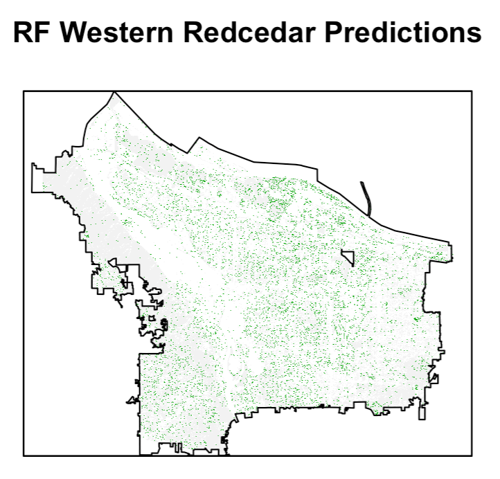
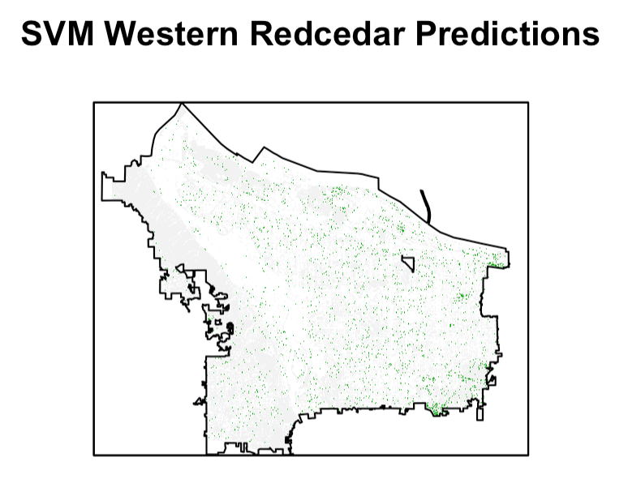

# Results {#results}

## Training Results

The best hyperparameters settings for the random forest training model were an mtry value of 4 predictors at each split and the following predictors: red, green, blue, infrared, NDVI, $\frac{\mbox{red}}{\mbox{green}}$, $\frac{\mbox{red}}{\mbox{blue}}$, $\frac{\mbox{blue}}{\mbox{green}}$. This model had a training predictive accuracy of 0.55 overall and 0.38 for Western redcedars specifically. On the test dataset, this model still accurately predicted 55% of the pixels, while the accuracy for predicting more than half the pixels correctly in the same polygon was 32%. The selected hyperparameter for the support vector machine model was a radial basis kernel with cost equal to 16 and $\sigma = 0.25$. The radial support vector machine had a training accuracy of 0.56 overall, 0.41 for just Western redcedars, and testing accuracy of 0.56 overall and 0.32 for Western redcedar pixels. For polygon predictions, the radial support vector machine had an accuracy of 36%. Between the random forest model and the support vector machine model, the radial basis kernel support vector machine model slightly outperforms the random forest 8 predictor model in overall accuracy, but the random forest has a slightly higher performance in predicting Western redcedars. Since these models produced similar results, both models are used to proceed with the final model over Portland.

## Modelling Tree Species in Portland

After masking the raster images of the entire region of Portland, the pre-trained models are used to predict the tree species of individual pixels in the masked raster images. The `predict.raster` function from RStudio's `raster` package takes a model and applying that model to each cell of the raster, leaving a raster with tree classification predictions. This function is used to predict tree species over all five raster strips, and the raster strips are merged to display predictions for the entire city. Figure \@ref(fig:rfPortland) displays the tree classification predictions given by the optimal random forest model over Portland and figure \@ref(fig:svmPortland) displays the predictions from the support vector machine model.

```{r rfPortland, results="asis", echo=FALSE, fig.cap="Model tree classification predictions over entire Portland region using the random forest model with 8 predictors.", out.width='70%', fig.align='center'}

```

```{r svmPortland, results="asis", echo=FALSE, fig.cap="Model tree classification predictions over entire Portland region using the support vector machine model with radial basis kernel.", out.width='70%', fig.align='center'}

```

To assess the performance of the model over the Portland region, the results are compared to the remaining Western redcedars from `pdxTrees` both street and park data. The shapefiles for `pdxTrees` Western redcedars ground data are mapped over the classified pixel predictions, and the number of correctly and incorrectly classified pixels is recorded. Figure \@ref(fig:resultsToStreet) visualizes this comparison.

```{r resultsToStreet, results="asis", echo=FALSE, fig.cap="Comparison of Wester redcedar random forest pixel predictions to Western redcedar trees from pdxTrees.", out.width='70%', fig.align='center'}
include_graphics("figure/resultsToStreet.png")
```


<!-- If we don't want Conclusion to have a chapter number next to it, we can add the `{-}` attribute. -->

<!-- **More info** -->

<!-- And here's some other random info: the first paragraph after a chapter title or section head _shouldn't be_ indented, because indents are to tell the reader that you're starting a new paragraph. Since that's obvious after a chapter or section title, proper typesetting doesn't add an indent there. -->

